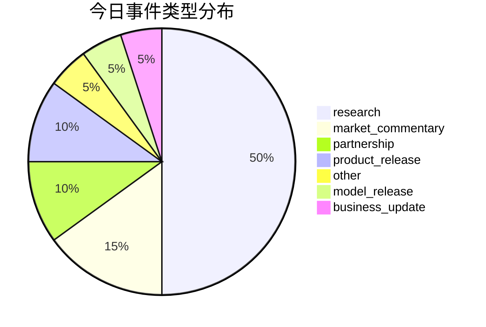
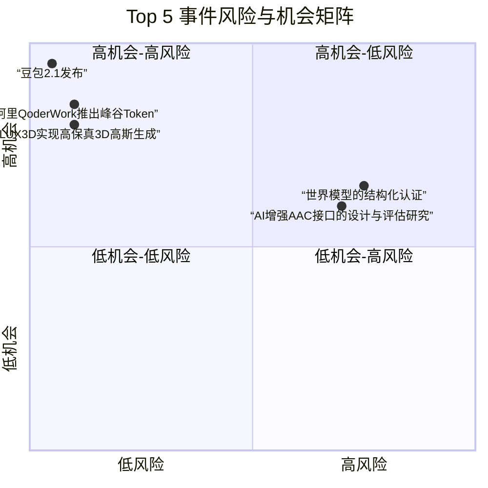

好的，这是为您生成的每日AI洞察报告。

***

# 每日 AI 洞察报告 | 2026年6月24日

## 1. 今日概览

今日AI领域呈现出“技术突破与产业落地并进”的态势。在学术前沿，多项研究在机器人自主技能获取、3D内容生成、AI安全理论等方面取得重要进展。产业层面，大模型应用进入精细化运营阶段，阿里推出“峰谷Token”以降低成本，豆包2.1版本展示了Agent在芯片设计等复杂工程任务中的潜力。同时，AI安全与信创产业的结合成为新焦点，360联合多家信创巨头发起安全协作计划。值得注意的是，企业AI转型的挑战正从技术层面转向组织与文化层面，这一观点在今日的报道中得到强调。

## 2. 今日 AI 领域 Top 5 热点事件

| 排名 | 事件名称 | 核心要点 | 来源 |
| :--- | :--- | :--- | :--- |
| **1** | **世界模型的结构化认证框架** | 研究证明通用智能体并非万能，并提出“结构化认证”框架，为AI系统的安全部署提供理论基础。 | arXiv |
| **2** | **AI增强AAC接口的设计与评估研究** | 研究探讨了AI在辅助沟通系统（AAC）中的应用复杂性，并提出更鲁棒的评估方法，关注用户多样性。 | arXiv |
| **3** | **阿里QoderWork推出“峰谷Token”夜间优惠** | 阿里推出国内首个“峰谷Token”的Agent产品，夜间使用Qwen3.7-Max模型低至2折，旨在降低用户成本。 | 量子位 |
| **4** | **豆包2.1发布，Agent自主完成芯片设计代码** | 豆包发布2.1版本（Pro和Turbo），其Agent可自主运行18小时完成芯片设计代码，展示了在复杂工程领域的应用潜力。 | 量子位 |
| **5** | **FLUX3D实现高保真3D高斯生成** | 提出FLUX3D框架，通过扩散对齐稀疏表示，在3D高斯生成任务上显著超越现有方法，提升外观保真度。 | arXiv |

*排名依据综合评分，综合考量了技术影响、商业影响、来源权威性及新颖性等因素。*

## 3. 重要事件深度总结

### 3.1 产业应用：大模型Agent进入精细化与工程化阶段

今日多个事件表明，大模型Agent正从概念验证走向精细化运营和复杂工程应用。

- **成本优化成为关键**：阿里QoderWork推出的“峰谷Token”策略（事件ID: evt_004），借鉴电力行业的峰谷定价模式，通过价格杠杆引导用户在非高峰时段使用算力。这标志着大模型服务商开始探索更精细化的商业模式，以降低用户门槛，推动Agent产品的规模化普及。该举措被报道为国内首个，具有行业示范意义。

- **Agent能力向高价值领域渗透**：豆包2.1的发布（事件ID: evt_010）及其在芯片设计代码生成上的应用，展示了Agent从简单的对话、编程辅助向更复杂的、需要长周期规划和执行的工程任务进军的潜力。虽然报道中未提供具体的技术细节，但“自主运行18小时”这一事实本身，就代表了Agent自主性和任务复杂度的显著提升。

- **开发者工具迎来变革**：Claude Code的大升级（事件ID: evt_005）被知名AI专家卡帕西誉为“LLM用户界面的第三次重大变革”。这表明LLM正从一个被动的问答工具，演变为一个能够独立、持续运行并与人类团队协同工作的“系统”。这预示着未来软件开发流程可能被重新定义。

### 3.2 学术前沿：AI安全与自主性理论取得突破

今日arXiv上的多篇论文在AI安全理论和机器人自主性方面提出了重要见解。

- **AI安全的理论基石**：一篇关于“世界模型的结构化认证”的论文（事件ID: evt_020）从理论上证明了“通用智能体并非万能”，并提出了“结构化认证”框架。该框架旨在定位智能体在哪些具体场景下的规划是可靠的，为高风险场景下的AI部署提供了理论上的安全保障。这为解决AI系统的“黑箱”问题和可解释性提供了新的思路。

- **机器人自主技能获取**：InSight框架（事件ID: evt_013）提出了一种让机器人通过视觉-语言-动作（VLA）模型自主获取新技能的方法，无需人类演示。这解决了机器人学习中的一个关键瓶颈——对大量人工标注数据的依赖，有望加速机器人在非结构化环境中的部署。

- **3D内容生成质量飞跃**：FLUX3D（事件ID: evt_015）在3D高斯生成任务上取得了显著进展，其生成的3D资产在视觉保真度上超越了现有所有方法。这对于游戏、影视、VR/AR等行业的3D内容创作效率和质量提升具有重要意义。

### 3.3 行业生态：AI安全与信创深度融合

360在ISC.AI 2026上发布AI安全能力并联合飞腾、麒麟等信创伙伴发起“磐石之盾”安全协作计划（事件ID: evt_001）。这一事件标志着AI安全正从单一企业的技术产品，上升为整个信创产业生态的协同行动。通过将AI安全能力与国产化硬件、操作系统深度绑定，旨在构建一个从底层芯片到上层应用的、自主可控的安全防护体系。这反映了在AI技术快速发展的背景下，国家层面对信息安全和供应链安全的双重考量。

## 4. 趋势判断

1.  **Agent应用进入“降本增效”与“能力深化”双轮驱动阶段**：一方面，以阿里“峰谷Token”为代表的成本优化策略将加速Agent的普及；另一方面，以豆包2.1和Claude Code为代表的技术进步，正将Agent的能力边界拓展到更复杂、更高价值的领域。未来，Agent的竞争将不仅是模型能力的竞争，更是商业模式和工程化能力的竞争。

2.  **AI安全研究从“事后补救”转向“事前认证”**：今日关于“世界模型结构化认证”的研究，代表了AI安全领域的一种新范式。即不再仅仅关注如何检测和防御攻击，而是尝试从理论层面证明AI系统在特定条件下的行为可靠性。这种“可认证的AI”理念，对于金融、医疗、自动驾驶等高风险领域的AI落地至关重要。

3.  **企业AI转型的“软实力”瓶颈凸显**：浪潮信息高管的观点（事件ID: evt_008）——AI转型最大的门槛不是技术，而是文化、组织和流程——得到了今日报道的强调。这预示着，随着AI技术本身的门槛逐渐降低，企业能否成功实现AI转型，将更多地取决于其组织变革能力、人才培养机制和业务流程的重塑。

## 5. 风险与机会提示

### 风险提示

- **AI转型的组织风险**：浪潮信息高管指出的“文化、组织和流程”挑战（事件ID: evt_008），是当前许多企业面临的真实风险。忽视组织变革，仅进行技术投入，可能导致AI项目难以落地或效果不及预期。**风险等级：中等**。
- **AI系统安全的理论风险**：虽然“结构化认证”提供了新思路，但该研究也明确指出“通用智能体并非万能”（事件ID: evt_020）。这意味着，在缺乏有效认证手段的情况下，将AI系统部署到开放、复杂的环境中仍存在不可预测的安全风险。**风险等级：中等**。
- **AAC接口评估挑战**：关于AI增强AAC接口的研究（事件ID: evt_017）指出，现有评估指标难以捕捉用户的复杂、多样化需求。这提醒我们，在开发面向特殊人群的AI产品时，需要采用更全面、更人性化的评估方法，否则可能无法真正满足用户需求。**风险等级：低**。

### 机会提示

- **AI安全与信创生态**：360发起的“磐石之盾”计划（事件ID: evt_001）为AI安全领域的公司提供了明确的合作方向和市场机会。与信创产业链（如芯片、操作系统）的深度绑定，有望形成强大的护城河。**机会等级：高**。
- **Agent成本优化方案**：阿里“峰谷Token”模式（事件ID: evt_004）的成功，预示着为大模型应用提供成本优化解决方案（如算力调度、模型压缩、定价策略）将成为一个新兴的蓝海市场。**机会等级：高**。
- **机器人自主技能学习**：InSight框架（事件ID: evt_013）等研究，为机器人公司提供了减少对昂贵人工演示依赖的技术路径。投资或应用此类技术，有望大幅降低机器人部署成本，加速其在物流、制造、服务等行业的落地。**机会等级：高**。
- **高保真3D内容生成**：FLUX3D（事件ID: evt_015）等技术的突破，为游戏、影视、电商等行业的3D内容创作者提供了强大的工具，有望大幅提升创作效率和内容质量。**机会等级：高**。

## 6. 可视化说明

### 6.1 今日事件类型分布

今日事件以学术研究（research）为主，占比50%，其次是市场评论（market_commentary）和产品发布（product_release），反映了今日AI领域学术创新与产业动态并重的特点。

### 6.2 Top 5 事件风险与机会矩阵

下图展示了今日排名前五的事件在风险与机会维度上的分布。可以看出，大部分高影响力事件（如豆包2.1、FLUX3D）呈现出“低风险、高机会”的特征，而部分理论研究（如世界模型认证）则伴随着相对较高的风险认知（可能源于其理论上的颠覆性）。

## 7. 数据与方法说明

- **数据来源**：本报告数据来源于对多个信息源的采集与整合，包括：
    - **学术预印本**：arXiv AI Search，提供最新研究论文摘要。
    - **行业媒体**：量子位（中文）、TechCrunch AI（英文）、The Verge（英文），提供产业动态与市场评论。
- **事件识别与排名**：通过自然语言处理技术从新闻和论文中提取关键事件，并基于**影响范围、来源权威性、技术/商业影响、新颖性、多源支持度**等多个维度进行综合评分与排序。
- **置信度说明**：报告中每个事件和判断均标注了置信度（高/中/低）。对于来源单一、信息不完整或存在推测性内容的事件，置信度会相应降低。例如，关于“具身智能融资”和“AI数学证明”的报道，由于缺乏具体数据支撑，其置信度被标记为“中等”。
- **局限性**：本报告基于2026年6月24日采集的数据生成，无法覆盖所有AI领域事件。部分信息可能因来源限制而存在偏差。趋势判断基于现有证据，未来可能发生变化。