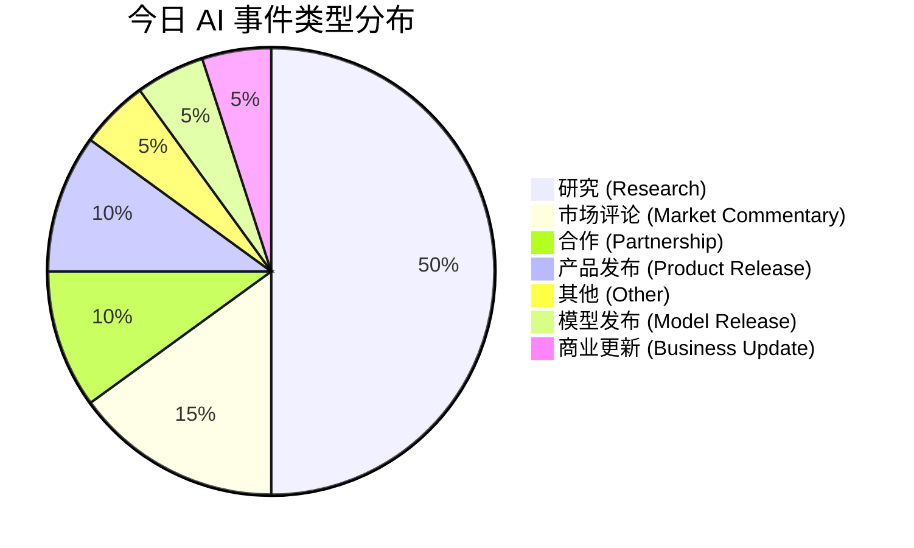
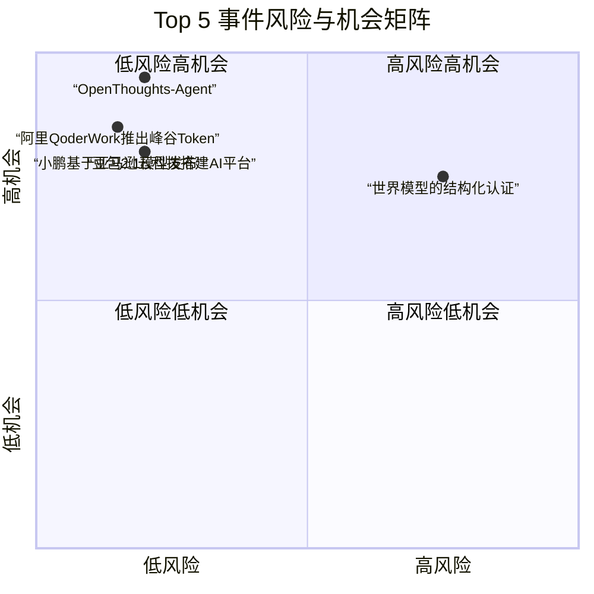

好的，这是为您生成的每日 AI 洞察报告。

***

# 每日 AI 洞察报告

**报告日期:** 2026-06-24
**生成时间:** 2026-06-24T13:47:46+08:00
**数据来源:** 量子位、TechCrunch AI、The Verge、arXiv

---

## 1. 今日概览

今日 AI 领域呈现出“产业落地加速”与“前沿理论突破”并行的态势。产业层面，国内大厂在 AI 安全、Agent 产品、模型服务及云计算应用上动作频频，显示出从技术研发向商业化、生态化演进的趋势。学术层面，多篇来自 arXiv 的高质量研究在机器人自主技能学习、3D 生成、智能体模型训练及 AI 安全理论等方面取得重要进展。值得注意的是，AI 在数学证明领域的突破和具身智能赛道的融资热潮，进一步印证了 AI 正从“感知”向“认知”与“行动”纵深发展。

## 2. 今日 AI 领域 Top 5 热点事件

| 排名 | 事件名称 | 核心领域 | 关键信息 | 来源 |
| :--- | :--- | :--- | :--- | :--- |
| **1** | **世界模型的结构化认证** | AI 安全/理论 | 提出结构化认证框架，为通用智能体的世界模型提供局部可靠性保证，解决智能体非普适性问题。 | arXiv |
| **2** | **阿里 QoderWork 推出“峰谷 Token”** | AI 基础设施 | 国内首个 Agent 产品上线“峰谷 Token”，夜间使用 Qwen3.7-Max 模型低至 2 折，大幅降低用户成本。 | 量子位 |
| **3** | **小鹏基于亚马逊云科技搭建 AI 平台** | AI 基础设施 | 小鹏汽车基于亚马逊云科技服务（Kiro, Bedrock, EKS）搭建企业内部 AI 编程与 Agentic 工作平台“灵犀”。 | 量子位 |
| **4** | **OpenThoughts-Agent: 开放数据配方训练智能体模型** | 基础模型/研究 | 发布完全开源的数据整理流程，训练出的 Qwen3-32B 模型在 7 个智能体基准测试中平均准确率达 44.8%，超越现有最强开源模型。 | arXiv |
| **5** | **豆包 2.1 模型发布** | 基础模型 | 字节跳动发布豆包 2.1 版本，包含 Pro 和 Turbo 两个模型，API 服务已全量上线火山方舟。 | 量子位 |

## 3. 重要事件深度总结

### 3.1 产业落地：AI 应用进入精细化运营与生态构建阶段

*   **阿里 QoderWork 推出“峰谷 Token” (event_004):** 该事件标志着 AI 服务定价模式的创新。通过引入类似电力行业的“峰谷”定价策略，阿里旨在引导用户将非紧急、批量的计算任务转移至夜间，从而优化算力资源利用率，并显著降低用户成本。此举有望加速 Agent 产品在企业级场景中的普及，是 AI 基础设施走向成熟的重要标志。
*   **360 发布 AI 安全能力并联合发起安全协作计划 (event_001):** 360 在 ISC.AI 2026 上发布了“倚天屠龙”两大 AI 安全核心能力，并联合飞腾、麒麟等信创巨头发起“磐石之盾”计划。这表明在 AI 快速发展的同时，产业界正积极构建从底层芯片到上层应用的“信创+安全”生态，以应对日益复杂的 AI 安全挑战。
*   **小鹏基于亚马逊云科技搭建 AI 平台 (event_010):** 小鹏汽车利用亚马逊云科技的 AI 服务构建内部平台“灵犀”，展示了云计算在赋能企业 AI 转型中的关键作用。这不仅是技术合作，更代表了企业将 AI 能力内化为自身核心竞争力的趋势。

### 3.2 前沿突破：AI 智能体与机器人能力边界持续拓展

*   **OpenThoughts-Agent (event_016):** 该项目通过完全开源的数据整理流程，证明了高质量、多样化的训练数据对于训练通用智能体模型至关重要。其训练的模型在多个基准上超越现有最强开源模型，为社区提供了宝贵的“数据配方”，有望推动智能体模型的民主化发展。
*   **InSight: 自主技能获取框架 (event_013):** 该研究提出了一种让机器人无需人类演示即可自主获取新技能的方法。通过将视觉-语言-动作（VLA）模型在基本动作层面变得“可操纵”，机器人能够自主尝试、学习并组合新技能，这对于推动机器人从“预设程序”向“自主学习”演进具有里程碑意义。
*   **世界模型的结构化认证 (event_020):** 这项理论研究为 AI 安全提供了新的视角。它指出通用智能体并非万能，并提出了“结构化认证”框架，用于局部验证智能体在关键决策点上的可靠性。这为未来高风险场景（如自动驾驶、医疗诊断）中部署 AI 智能体提供了理论基础。

### 3.3 行业风向：具身智能与 AI 数学推理成为资本与学术焦点

*   **2026 年具身智能融资增长迅速 (event_007):** 数据显示，2026 年尚未过半，具身智能领域的融资额已接近去年全年，且超过一半的资金流向了机器人的“大脑”（即决策与认知系统）。这清晰地表明，资本正从关注硬件本体转向押注“智能”本身，具身智能的“大脑”竞赛已全面打响。
*   **AI 在数学证明领域取得进展 (event_008):** 从 OpenAI 解决开放问题到 DeepMind 批量攻克数学猜想，AI 在形式化数学证明领域的能力正在兑现。这不仅可能改变数学研究的方式，更意味着 AI 在逻辑推理和复杂问题求解上取得了实质性突破，其影响将辐射到需要严谨逻辑的各个领域。

## 4. 趋势判断

1.  **AI 服务“基础设施化”与“精细化运营”：** 阿里推出“峰谷 Token”是 AI 服务走向类似水电等公共基础设施的明确信号。未来，模型调用成本将持续下降，定价模式将更加灵活，以匹配不同场景和用户需求。
2.  **智能体（Agent）成为 AI 应用的核心范式：** 从阿里 QoderWork、小鹏“灵犀”到 OpenThoughts-Agent，Agent 正从概念走向产品化和平台化。LLM 不再仅仅是聊天工具，而是演变为能独立运行、调用工具、与团队协作的“数字员工”。
3.  **AI 安全从“被动防御”转向“主动免疫”与“理论认证”：** 360 的“倚天屠龙”代表了产业界主动构建 AI 安全能力的努力，而“世界模型的结构化认证”则代表了学术界从理论层面为 AI 系统提供可靠性保证的探索。两者结合，预示着 AI 安全将进入一个“攻防兼备、理论先行”的新阶段。
4.  **机器人“大脑”成为具身智能赛道的核心战场：** 融资数据明确指向了机器人“大脑”的价值。未来，具身智能领域的竞争将更多体现在算法、模型和数据处理能力上，而非单纯的硬件制造。

## 5. 风险与机会提示

### 风险提示
*   **AI 转型的组织挑战 (event_009):** 浪潮信息彭震的观点值得深思：AI 转型的最大门槛不是技术，而是人。企业若忽视文化、组织和流程的变革，即使拥有最先进的技术也可能失败。**风险等级：中等。**
*   **智能体可靠性风险 (event_020):** 理论研究已证明通用智能体并非万能，其可靠性存在边界。在关键任务中过度依赖未经充分认证的智能体，可能带来不可预知的风险。**风险等级：中等。**
*   **好莱坞对 AI 题材的复杂态度 (event_012):** 主流制片厂对 OpenAI 传记电影的回避，反映出公众舆论和娱乐产业对 AI 的复杂情绪。这可能影响 AI 公司的公众形象和品牌价值。**风险等级：低。**

### 机会提示
*   **AI 安全与信创合作 (event_001):** 360 联合信创巨头发起的计划，为相关安全技术提供商、信创生态伙伴创造了巨大的合作与市场机会。
*   **成本优化与 Agent 产品 (event_004):** “峰谷 Token”模式降低了 Agent 的使用门槛，为开发者和企业大规模采用 Agent 技术创造了条件，相关应用和生态将迎来爆发。
*   **开源智能体模型 (event_016):** OpenThoughts-Agent 的开源数据和方法，为中小企业和研究机构提供了低成本训练高性能智能体模型的机会，有望催生更多垂直领域的智能体应用。
*   **机器人自主技能学习 (event_013):** InSight 框架为机器人应用开辟了新路径，在工业自动化、家庭服务、特种作业等领域具有巨大的商业化潜力。

## 6. 可视化说明

### 6.1 今日事件类型分布
今日事件以学术研究（Research）为主，占比 50%，其次是市场评论（Market Commentary）和产品发布（Product Release），显示出今日 AI 领域学术创新与产业动态并重。

### 6.2 Top 5 事件风险与机会矩阵
下图展示了今日 Top 5 事件的风险与机会水平。可以看出，**OpenThoughts-Agent** 和 **阿里 QoderWork** 展现出极高的机会水平，而 **世界模型的结构化认证** 则因其理论上的风险警示，风险水平相对较高。

## 7. 数据与方法说明

*   **数据来源：** 本报告数据来源于 4 个核心信源：**量子位**（中文 AI 产业报道）、**TechCrunch AI**（国际 AI 创投与产业分析）、**The Verge**（消费科技与 AI 报道）以及 **arXiv AI Search**（最新 AI 研究预印本）。
*   **事件筛选与排名：** 从上述信源中提取 20 个新闻与 20 个研究事件，通过多维度评分模型（包括影响范围、来源权威性、技术/商业影响、新颖性、时效性等）进行综合打分与排名，最终筛选出 Top 5 热点事件。
*   **置信度说明：** 报告中对每个事件和判断均标注了置信度（高/中/低）。对于来源单一、信息不够详尽或涉及预测性判断的内容，我们标注了“中等”置信度，提醒读者注意不确定性。例如，关于好莱坞电影发行的事件（event_012），由于信息来自单一信源且涉及多方商业决策，置信度为“中等”。
*   **数据局限性：** 本报告数据主要来源于公开的媒体和学术预印本，可能无法覆盖所有非公开的行业动态。研究类事件主要基于论文摘要，其最终结论和影响力需经同行评议和时间检验。