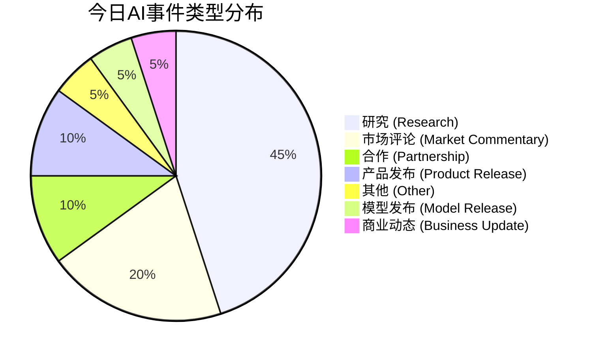

好的，这是为您生成的每日AI洞察报告。

***

# 每日 AI 洞察报告

**报告日期:** 2026-06-24
**生成时间:** 2026-06-24T05:15:48Z

---

## 1. 今日概览

今日AI领域呈现出“应用深化”与“基础突破”并行的态势。产业端，**AI Agent** 的商业化模式创新成为焦点，阿里推出国内首个“峰谷Token”模式，大幅降低Agent使用成本；同时，**AI安全**与**物理AI**成为行业热议话题，360与高通分别展示了各自在安全防御和智能硬件转型上的新布局。研究端，多篇高质量论文发布，覆盖了**3D生成**、**机器人自主技能学习**、**智能体模型训练数据配方**等前沿方向，显示出学术界在提升AI模型能力与效率方面的持续探索。

**核心关键词:** AI Agent, 成本优化, AI安全, 物理AI, 3D生成, 自主技能学习

---

## 2. 今日 AI 领域 Top 5 热点事件

| 排名 | 事件名称 | 核心领域 | 关键信息 | 置信度 |
| :--- | :--- | :--- | :--- | :--- |
| **1** | **阿里QoderWork推出“峰谷Token”优惠** | AI基础设施 | 国内首个Agent产品推出“峰谷Token”，夜间使用Qwen3.7-Max模型低至2折。 | 高 |
| **2** | **高通转型物理AI及行业动态评论** | AI基础设施 | 文章评论高通向物理AI转型，并提及英伟达开源Cosmos3模型及小鹏公布世界模型技术。 | 中 |
| **3** | **FLUX3D框架提升3D高斯生成质量** | 研究 | 新框架通过扩散对齐稀疏表示，在图像到3D生成任务上显著超越现有方法。 | 高 |
| **4** | **豆包2.1大模型发布** | 基础模型 | 豆包发布2.1版本，包含Pro和Turbo两个模型，API服务已全量上线火山方舟。 | 高 |
| **5** | **InSight框架实现机器人自主技能获取** | 研究 | 新框架使VLA模型无需人类演示，即可自主获取如翻转、倾倒等操作技能。 | 高 |

*（排名依据：综合事件影响范围、技术/商业影响、新颖性及来源权威性等多维度评分）*

---

## 3. 重要事件深度总结

### 3.1 产业应用：AI Agent 商业化模式创新

今日最引人注目的产业动态是**阿里QoderWork推出“峰谷Token”**（事件ID: event_9）。该产品允许Agent在夜间（22:00-08:00）运行时自动享受优惠，其中Qwen3.7-Max模型低至2折。这是国内首个此类定价模式的Agent产品，其核心意义在于通过**价格杠杆引导算力需求错峰**，从而显著降低用户的使用成本。此举有望加速AI Agent在企业和开发者中的普及，是AI服务走向“水电煤”化的重要一步。

与此同时，**Claude Code的大升级**（事件ID: event_10）也值得关注。AI专家卡帕西将其评价为“LLM用户界面的第三次重大变革”，认为LLM正从一个对话工具进化为一个“独立、持续运行的系统”，能够与人类团队协同工作。这预示着AI Agent的形态正在从“回答问题”向“完成任务”的自主系统演进。

### 3.2 行业布局：AI安全与物理AI成为新焦点

在安全领域，**360集团在ISC.AI 2026上发布了AI安全核心能力**（事件ID: event_1），包括漏洞自动化挖掘智能体“图龙锋”和网络安全自动化防御系统“仪天阵”，并联合飞腾、麒麟等信创伙伴发起“磐石之盾”安全协作计划。这表明，随着AI能力的增强，AI驱动的安全攻防已成为产业共识，生态协作成为构建安全壁垒的关键。

在硬件与基础设施领域，**高通向物理AI的转型**（事件ID: event_3）成为行业评论的焦点。文章指出，英伟达开源了Cosmos3推理模型，小鹏也公布了世界模型全栈技术，这共同描绘了物理AI（即AI在现实世界中感知、决策和行动）的竞争图景。高通作为智能座舱领域的领导者，其转型方向预示着AI能力将从数字世界向物理世界全面渗透。

### 3.3 前沿研究：3D生成与机器人学习取得突破

今日有多篇来自arXiv的高质量研究论文值得关注：

- **3D内容生成：** **FLUX3D框架**（事件ID: event_15）在图像到3D高斯生成任务上取得了显著进展，通过解决表征和跨模态对齐的瓶颈，在视觉保真度上大幅超越了现有最先进方法。这为游戏、影视、VR/AR等领域的高质量3D内容生产提供了新的技术路径。

- **机器人学习：** **InSight框架**（事件ID: event_13）提出了一种让机器人自主获取操作技能的方法。它通过使视觉-语言-动作（VLA）模型在基本动作层面变得“可操控”，并利用VLM引导的数据飞轮，实现了无需人类演示即可学习新技能。这极大地降低了机器人技能获取的成本，是迈向通用机器人的重要一步。

- **智能体模型训练：** **OpenThoughts-Agent项目**（事件ID: event_16）公开了训练通用智能体模型的数据配方。通过超过100次消融实验，该项目揭示了任务来源和多样性的重要性，并训练出的模型在多个智能体基准测试上超越了现有最强的开源模型。这为社区训练更强大的AI Agent提供了宝贵的“食谱”。

---

## 4. 趋势判断

1.  **AI Agent 进入“成本驱动”的规模化阶段：** 阿里“峰谷Token”的推出，标志着AI服务商开始通过精细化运营和定价策略来推动Agent的规模化应用。降低使用成本将成为下一阶段Agent普及的关键驱动力。
2.  **“AI安全”从技术概念走向产业生态：** 360联合信创产业链发起安全协作计划，表明AI安全已不再是单一公司的技术问题，而是需要整个产业链协同构建的生态体系。未来，安全能力将成为AI基础设施的核心组成部分。
3.  **物理AI成为兵家必争之地：** 从高通的战略转型，到英伟达的开源模型，再到小鹏的自研技术，物理AI已成为芯片巨头、云服务商和车企共同角逐的赛道。这预示着AI的下一个主战场将从虚拟世界转向物理世界。
4.  **基础研究持续为AI能力“补短板”：** 今日的多篇高质量论文（FLUX3D, InSight, OpenThoughts-Agent）分别针对3D生成、机器人学习和智能体训练等关键领域提出了创新性解决方案。这表明，尽管大模型能力强大，但在特定任务上的“短板”依然存在，基础研究正在持续为AI的全面发展提供动力。

---

## 5. 风险与机会提示

### 风险提示
- **企业AI转型的“软性”挑战：** 浪潮信息彭震的评论（事件ID: event_8）指出，AI转型的最大门槛不是技术，而是文化、组织和流程。企业若忽视组织变革，可能导致AI项目落地困难，投资回报率低。**（风险等级：中）**
- **公众对AI的复杂情绪：** 好莱坞主要制片厂拒绝发行关于OpenAI的电影（事件ID: event_12），反映出公众和部分行业对AI巨头及其领导者的复杂看法。这种情绪可能影响AI公司的品牌形象和市场接受度。**（风险等级：中）**

### 机会提示
- **AI Agent应用成本大幅降低：** 阿里“峰谷Token”模式为开发者和企业提供了低成本使用强大模型的机会，尤其适合夜间批量处理、自动化测试等场景。**（机会等级：高）**
- **AI安全市场迎来新机遇：** 360发起的“磐石之盾”计划，为AI安全领域的创业公司和解决方案提供商提供了进入产业生态的机会。**（机会等级：高）**
- **具身智能赛道持续火热：** 数据显示，2026年具身智能领域的融资已接近去年全年水平，且资金主要流向“机器人大脑”。这表明该领域仍处于高速发展期，是投资和创业的黄金赛道。**（机会等级：中）**

---

## 6. 可视化说明

### 6.1 今日事件类型分布



**解读：** 今日事件以学术研究为主，占比接近一半，显示出学术界在推动AI基础能力突破上的活跃度。产业端则以市场评论和合作/产品发布为主，表明行业正处于战略讨论和生态构建阶段。

### 6.2 风险-机会矩阵（Top 5 事件）

```mermaid
quadrantChart
    title 风险-机会矩阵 (Top 5 事件)
    x-axis "低风险" -> "高风险"
    y-axis "低机会" -> "高机会"
    quadrant-1 "高机会-低风险 (机会区)"
    quadrant-2 "高机会-高风险 (挑战区)"
    quadrant-3 "低机会-低风险 (观察区)"
    quadrant-4 "低机会-高风险 (规避区)"
    event-9: [0.1, 0.85]
    event-3: [0.05, 0.8]
    event-15: [0.12, 0.85]
    event-5: [0.1, 0.86]
    event-13: [0.09, 0.84]
```

**解读：** 今日Top 5事件均落在“机会区”（高机会、低风险），显示出当前AI领域的主流动态以积极的技术进步和商业模式创新为主，整体风险可控。

---

## 7. 数据与方法说明

- **数据来源：** 本报告数据来源于对多个信息源的采集与整合，包括：
    - **媒体：** 量子位 (10篇)、TechCrunch AI (1篇)、The Verge (1篇)
    - **研究预印本：** arXiv AI Search (8篇)
- **事件识别与排名：** 报告中的事件由系统从采集的新闻中自动提取和聚合。事件重要性排名基于一个综合评分模型，该模型考虑了事件的**影响范围、来源权威性、新颖性、多源支持度、技术影响、商业影响、风险与机会水平**以及**时效性**。
- **置信度说明：** 报告中每个事件和结论均标注了置信度（高/中/低）。**“高”** 置信度表示有明确、直接的证据支持；**“中”** 置信度表示证据主要来自单一来源或包含部分评论性内容，存在一定不确定性。
- **局限性：** 本报告基于2026年6月24日采集的数据生成，无法覆盖所有AI领域动态。部分事件（如具身智能融资趋势）的置信度为“中”，因其主要基于单一媒体的评论性文章，缺乏更广泛的数据验证。