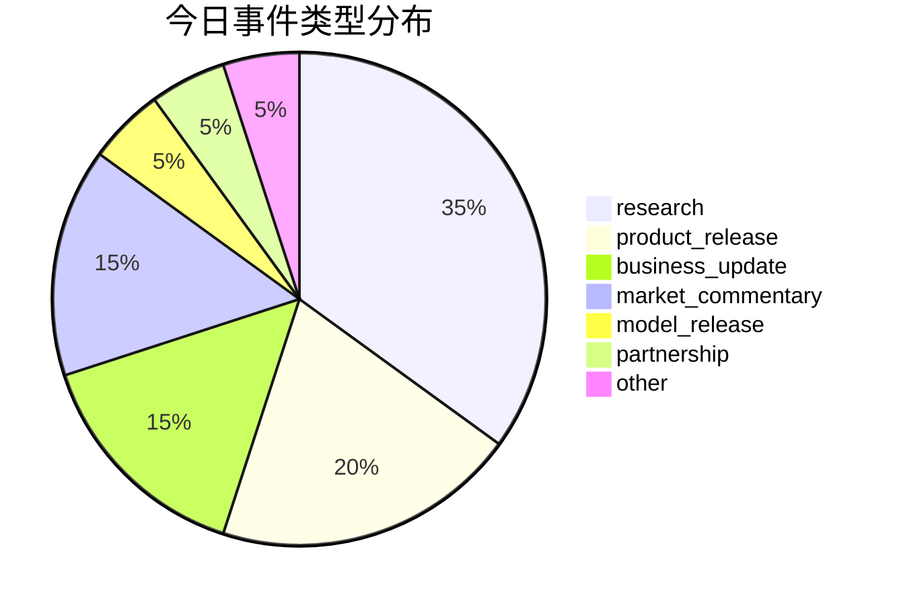
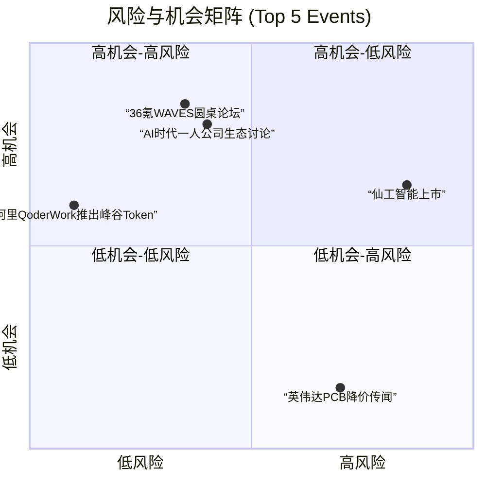

好的，这是根据您提供的结构化数据生成的每日AI洞察报告。

---

# 每日 AI 洞察报告

**报告日期：** 2026年6月24日
**生成时间：** 2026-06-24T07:31:43Z
**数据来源：** 量子位、36氪、TechCrunch AI、The Verge、arXiv

---

## 1. 今日概览

今日AI领域呈现“多点开花”态势，热点集中在**基础模型性能突破**、**AI编程工具进化**、**AI安全生态构建**以及**具身智能商业化进展**四大方向。

- **模型竞赛白热化**：字节跳动发布**豆包2.1**，在多项基准测试中与Claude Opus 4.7持平甚至超越，展示了国产大模型的强劲实力。
- **AI编程范式革新**：Anthropic将**Claude Code升级为Claude Tag**，更强调主动协作，被业界领袖誉为“LLM第三次变革”。
- **AI安全成为焦点**：360在ISC大会上发布AI安全能力矩阵，并联合信创企业发起“磐石之盾”计划，旨在打造中国版“Mythos”。
- **具身智能持续升温**：36氪WAVES论坛上，多家创业公司分享了在触觉传感器、世界模型、机器人等领域的突破性进展，商业化落地加速。

此外，市场层面也出现波动，英伟达PCB降价传闻导致板块大跌，而仙工智能上市首日的股价“过山车”行情则反映了市场对高估值科技股的复杂情绪。

---

## 2. 今日 AI 领域 Top 5 热点事件

| 排名 | 事件名称 | 核心要点 | 重要性评分 | 来源 |
| :--- | :--- | :--- | :--- | :--- |
| **1** | **36氪WAVES2026圆桌论坛讨论科技趋势** | 具身智能、世界模型、触觉传感器等赛道取得显著进展，商业化进程加速。 | **3.4** | 36氪 |
| **2** | **仙工智能上市首日股价大幅波动** | 暗盘破发后首日冲高回落，市场对其高估值和盈利持续性存疑。 | **3.4** | 36氪 |
| **3** | **AI时代一人公司（OPC）生态讨论** | AI平权降低创业门槛，“一人公司”模式兴起，平台生态成为关键。 | **3.4** | 36氪 |
| **4** | **阿里QoderWork推出峰谷Token** | 国内首个Agent产品推出峰谷计价模式，夜间使用Qwen3.7-Max低至2折，旨在降低AI应用成本。 | **3.3** | 量子位 |
| **5** | **英伟达PCB降价传闻导致板块大跌** | 市场传闻英伟达要求PCB厂商降价10%，导致PCB板块大幅下挫，胜宏科技回应称经营正常。 | **3.28** | 36氪 |

---

## 3. 重要事件深度总结

### 3.1 基础模型与AI编程：豆包2.1与Claude Tag

- **豆包2.1发布 (event_6)**：字节跳动发布豆包2.1，包含Pro和Turbo两个版本。其Seed 2.1 Pro模型在**Terminal Bench 2.1**上与Claude Opus 4.7持平，在**SciCode**和**MCP-Atlas**上甚至超越了Opus 4.7和GPT-5.5。一个引人注目的案例是，该模型连续运行近18小时，自主完成了芯片设计的RTL代码。这表明国产大模型在复杂任务处理能力上已跻身世界一流水平。
- **Anthropic升级Claude Tag (event_3)**：Anthropic将Claude Code升级为Claude Tag，使其更主动、更擅长团队协作。据Anthropic透露，其公司约65%的产品代码已由Claude Tag参与完成。AI领域知名人士卡帕西将此称为“LLM第三次变革”，标志着AI编程工具从被动辅助向主动协作的范式转变。

### 3.2 AI安全与基础设施：360的“磐石之盾”与阿里的“峰谷Token”

- **360发布AI安全能力 (event_4)**：周鸿祎在ISC.AI 2026上发布了“图龙锋”和“仪天阵”两大AI安全能力，并联合飞腾、麒麟等信创企业发起“磐石之盾”安全协作计划，宣布打造中国版“Mythos”。此举将AI安全提升到国家战略和生态建设的高度，反映出AI安全已成为行业发展的核心议题。
- **阿里推出峰谷Token (event_2)**：阿里QoderWork推出国内首个“峰谷Token”模式，在夜间（22:00-08:00）使用Qwen3.7-Max模型价格低至2折。这一创新定价策略旨在降低Agent应用的算力成本，有望推动AI应用的普及和商业化落地。

### 3.3 具身智能与商业化：WAVES论坛与仙工智能上市

- **WAVES论坛揭示行业进展 (event_7)**：36氪WAVES2026圆桌论坛上，多家创业公司披露了亮眼成绩：**帕西尼感知科技**的触觉传感器出货量位居第一；**擎朗智能**海外营收占比超过50%；**极佳视界**的世界模型在权威评测中击败谷歌、英伟达登顶；**大界机器人**的型材切割机器人性能超越欧洲冠军。这些案例表明，具身智能正从实验室走向规模化应用。
- **仙工智能上市首日波动 (event_11)**：工业智能机器人公司仙工智能在港交所上市首日经历剧烈波动，暗盘破发7.28%，开盘后最高涨38.3%，最终收涨13.88%。尽管其控制器全球市场份额高达24.8%，但整体收入排名仅全球第七（1.1%），市场对其高估值和盈利持续性存在分歧。

---

## 4. 趋势判断

1.  **AI Agent进入“成本驱动”阶段**：阿里推出“峰谷Token”模式，标志着AI应用开始从技术驱动转向成本驱动。降低推理成本将成为推动Agent大规模落地的关键因素。
2.  **AI编程工具从“辅助”走向“协作”**：Claude Tag的升级和Anthropic内部的高使用率表明，AI编程工具正在从代码补全工具演变为能够主动参与项目、理解上下文、进行团队协作的“数字同事”。
3.  **具身智能商业化加速，但分化明显**：WAVES论坛上多家公司披露的商业化数据（如擎朗海外营收超50%）表明，部分细分赛道已进入收获期。然而，仙工智能的股价波动也提示，市场对“高市占率、低利润率”的商业模式仍持谨慎态度。
4.  **AI安全从“单点防御”走向“生态共建”**：360联合信创企业发起“磐石之盾”计划，预示着AI安全不再是单一公司的产品，而是需要产业链上下游协同构建的生态系统，尤其是在自主可控的背景下。

---

## 5. 风险与机会提示

### 风险提示

- **市场传闻与股价波动风险**：英伟达PCB降价传闻导致板块大跌（event_8），显示了市场对供应链变化的敏感性。投资者需警惕未经证实的市场传闻带来的短期波动风险。
- **高估值科技股的市场考验**：仙工智能上市首日的股价波动（event_11）反映了市场对高估值、盈利能力尚待验证的科技公司的审慎态度。类似公司上市后可能面临较大的估值回调压力。
- **AI安全风险**：360发布的AI安全能力（event_4）本身也揭示了AI系统面临的漏洞和攻击风险。随着AI应用深入，安全事件的发生概率和影响范围都将增加。

### 机会提示

- **AI芯片设计**：豆包2.1成功完成芯片设计RTL代码（event_6），展示了AI在半导体设计领域的巨大潜力。这为EDA工具和AI辅助设计公司提供了新的增长点。
- **AI Agent应用与成本优化**：阿里“峰谷Token”（event_2）降低了Agent使用门槛，为开发者和企业提供了低成本试错和部署AI Agent的机会，利好Agent应用生态。
- **具身智能核心零部件**：帕西尼触觉传感器出货量第一（event_7）表明，在机器人整机竞争激烈的同时，上游核心零部件（如传感器、控制器）市场存在明确的增长机会。
- **AI平权与一人公司（OPC）**：AI工具降低了创业门槛，一人公司模式兴起（event_12）。平台方（如阿里云）和工具提供商（如Replit）将受益于这一趋势。

---

## 6. 可视化说明

### 6.1 今日事件类型分布

今日事件以**研究类**（7个）和**产品发布类**（4个）为主，反映了行业在技术突破和商业化落地上的双重努力。市场评论类事件（3个）也占据了重要位置，表明市场对AI行业的关注度极高。

### 6.2 风险与机会矩阵

下图展示了今日Top 5事件的风险与机会水平。可以看出，**36氪WAVES圆桌论坛**和**AI时代一人公司生态讨论**呈现出高机会、中等风险的特征，是值得关注的积极信号。而**仙工智能上市**和**英伟达PCB降价传闻**则表现出较高的风险水平。

---

## 7. 数据与方法说明

- **数据来源**：本报告数据来源于5个核心信源，包括中文科技媒体（量子位、36氪）、英文科技媒体（TechCrunch AI、The Verge）以及学术预印本平台（arXiv AI Search）。
- **事件识别与评分**：通过分析20条结构化新闻和20个识别出的事件，采用多维度评分模型（涵盖影响范围、来源权威性、技术/商业影响、新颖性、时效性等）进行综合评分，最终筛选出Top 5热点事件。
- **置信度说明**：所有分析均基于提供的数据。对于部分来源单一或信息不完整的事件（如英伟达PCB降价传闻、Pragmatic半导体新品），报告中已标注“中等”置信度，提醒读者注意不确定性。
- **局限性**：本报告未覆盖所有AI领域事件，分析结论受限于当日数据源的范围和质量。趋势判断基于现有事实，不构成投资建议。