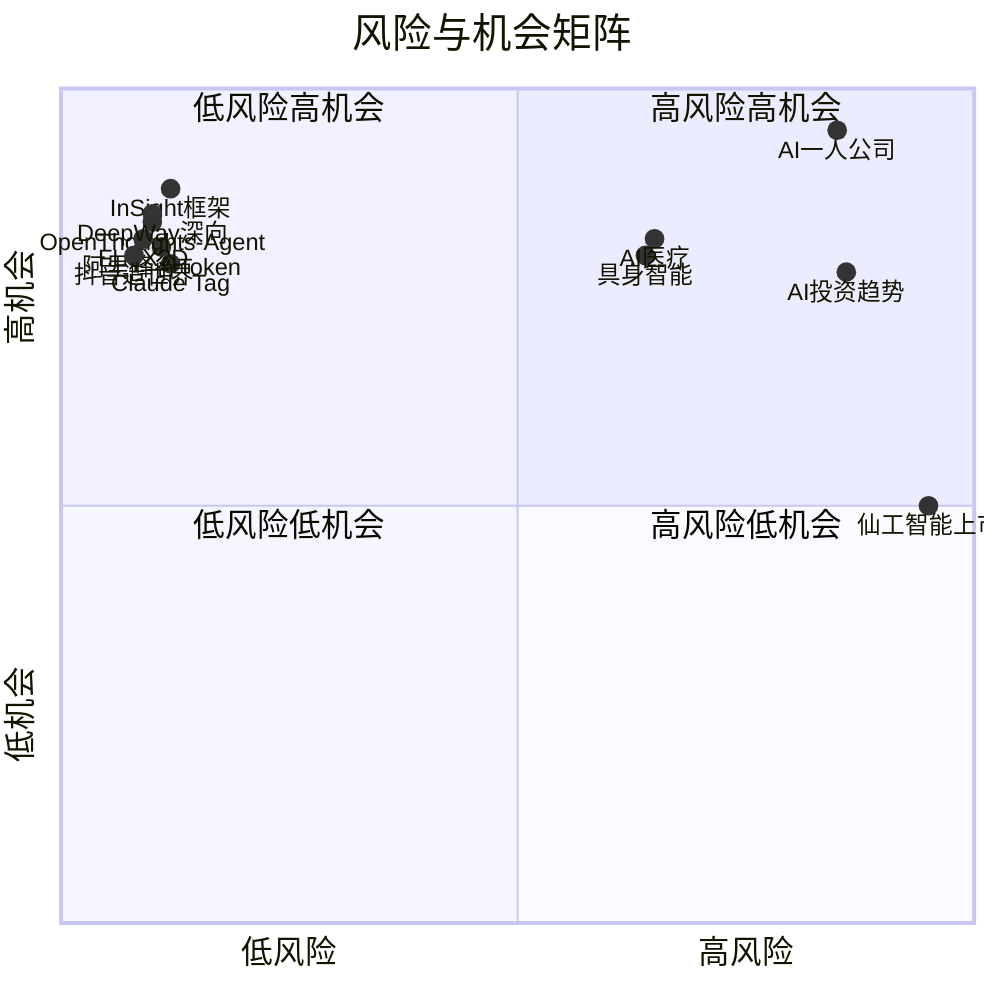

好的，这是根据您提供的结构化数据生成的每日AI洞察报告。

---

# 每日 AI 洞察报告 | 2026年6月24日

## 1. 今日概览

今日AI领域呈现出“商业落地加速”与“基础研究突破”并行的态势。在商业层面，物理AI在公路货运领域率先跑通商业闭环，成为今日最受关注的事件；同时，AI Agent的成本优化（阿里峰谷Token）和工具进化（Claude Tag）也取得重要进展。在产业生态层面，36氪WAVES大会上的多场圆桌讨论揭示了AI投资、医疗、具身智能及“一人公司”等领域的深刻变革与挑战。学术研究方面，多篇高质量论文在机器人技能学习、3D生成和智能体模型训练等领域取得突破。

## 2. 今日 AI 领域 Top 5 热点事件

| 排名 | 事件名称 | 核心要点 | 来源 | 综合评分 |
| :--- | :--- | :--- | :--- | :--- |
| **1** | **DeepWay深向智能新能源重卡规模化交付** | 物理AI在公路货运领域率先实现数据与商业双闭环，被多家头部物流企业采用。 | 量子位 | 3.69 |
| **2** | **36氪WAVES2026圆桌讨论AI“一人公司”** | AI平权催生“超级个体”，一人公司利用AI工具实现接近公司的交付能力，云服务需求增长。 | 36氪 | 3.51 |
| **3** | **抖音发布3D内容创作工具“造世界”** | 集成多Agents，降低3D UGC门槛，服务于抖音3D社交场景。 | 36氪 | 3.47 |
| **4** | **36氪WAVES2026圆桌讨论AI投资趋势** | 讨论Anthropic模型因安全限制停服，中国大模型公司通过开源应对，AI Agent成为投资热点。 | 36氪 | 3.47 |
| **5** | **36氪WAVES2026圆桌讨论AI医疗** | AI制药进入关键转折点，望石智慧与广药、华为达成三方合作，数据成为核心壁垒。 | 36氪 | 3.47 |

## 3. 重要事件深度总结

### 3.1 商业落地：物理AI与AI Agent的“双轮驱动”

- **物理AI商业化里程碑**：**DeepWay深向**的智能新能源重卡实现规模化交付，被**鸭嘴兽、马士基、安能、申通**等货运物流企业采用。这标志着物理AI在公路货运这一万亿级市场中率先跑通了商业闭环，验证了自动驾驶重卡的经济可行性，对行业具有极强的示范效应（事件ID: evt_005）。
- **AI Agent成本与能力进化**：
    - **成本优化**：**阿里QoderWork**推出国内首个“峰谷Token”模式，夜间使用**Qwen3.7-Max**模型低至2折。此举大幅降低了Agent的使用成本，有望推动AI Agent的普及（事件ID: evt_001）。
    - **能力进化**：**Anthropic**推出**Claude Tag**，定位为Claude Code的进化版，更主动、更擅长团队协作。公司内部约65%的产品代码已由Claude Tag参与完成。AI专家**卡帕西**称其为“LLM用户界面的第三次重大变革”，预示着AI编程工具正从辅助编码向深度参与软件开发全流程演进（事件ID: evt_002）。

### 3.2 产业生态：AI转型的“人”与“组织”之困

- **转型最大门槛是人**：**浪潮信息**董事长**彭震**在AIEC2026上提出，AI转型最大的门槛不是技术，而是人，并提出了“**Humagent**”概念，强调组织、文化、流程是转型的关键。这提醒业界，在追逐技术的同时，必须重视组织变革的阻力（事件ID: evt_003）。
- **“一人公司”崛起**：在36氪WAVES2026上，圆桌讨论揭示了AI时代“一人公司”（OPC）的兴起。阿里云调研显示，传统开发者仅占20%，而产品运营和企业主占比更高。AI工具让个体拥有了接近公司的交付能力，催生了新的创业模式，但也带来了同质化竞争和平台依赖的风险（事件ID: evt_012）。
- **具身智能商业化仍需突破**：尽管中国在服务机器人领域领先（如帕西尼触觉传感器出货量第一），但圆桌讨论指出，具身智能的商业化落地依然缓慢，需要突破技术瓶颈和应用场景（事件ID: evt_010）。

### 3.3 学术前沿：机器人学习与3D生成取得突破

- **机器人自主技能学习**：**InSight**框架提出了一种无需人类演示，即可让机器人通过可操控的视觉-语言-动作（VLA）模型自主获取新技能的方法。该框架在模拟和真实任务中均表现出色，为机器人实现长时任务执行提供了新思路（事件ID: evt_015）。
- **高保真3D生成**：**FLUX3D**框架通过引入扩散对齐的稀疏表示（DA-SLAT）和稀疏结构多模态扩散Transformer（SMDiT），在图像到3D高斯泼溅（3DGS）生成任务上，显著超越了现有方法，提升了生成内容的外观保真度（事件ID: evt_017）。
- **开源智能体模型**：**OpenThoughts-Agent**项目开源了完整的智能体模型训练数据管线。通过超过100次消融实验，该管线微调的**Qwen3-32B**模型在7个智能体基准测试中取得了44.8%的平均准确率，超越现有最强开源模型，为智能体AI研究提供了宝贵资源（事件ID: evt_018）。

## 4. 趋势判断

1.  **AI Agent进入“普惠化”与“专业化”并行阶段**：一方面，阿里“峰谷Token”等成本优化措施降低了Agent的使用门槛，推动其普惠化；另一方面，Anthropic的Claude Tag等工具正朝着更专业、更深度参与团队协作的方向进化。这表明AI Agent市场正在快速分化。
2.  **物理AI商业化从“概念验证”走向“规模落地”**：DeepWay深向在公路货运领域的成功，是物理AI商业化的重要里程碑。预计未来将有更多物理AI应用在物流、制造、农业等垂直领域跑通商业闭环。
3.  **AI产业投资逻辑从“技术驱动”转向“应用与数据驱动”**：从WAVES大会的讨论可以看出，投资热点正从基础大模型转向AI Agent、AI制药等具体应用场景。数据壁垒和商业化能力成为评估项目价值的关键。
4.  **开源生态成为应对地缘政治风险的关键策略**：面对Anthropic模型因安全限制停服等事件，中国大模型公司纷纷选择开源，以构建自主可控的技术生态，并吸引全球开发者。

## 5. 风险与机会提示

### 风险提示
- **组织变革阻力**：浪潮信息提出的“Humagent”概念揭示了AI转型中“人”的挑战。企业若忽视组织文化、流程的变革，技术投入可能无法转化为实际效益（风险等级：2.613）。
- **地缘政治与模型安全**：Anthropic模型因安全问题被限制使用的事件，凸显了AI行业面临的地缘政治和合规风险。依赖单一或特定地区模型的企业需警惕供应链中断风险（风险等级：3.445）。
- **商业化落地缓慢**：具身智能等前沿领域虽然技术进展迅速，但商业化落地依然缓慢，投资者需警惕估值泡沫（风险等级：2.614）。
- **同质化竞争与平台依赖**：AI“一人公司”模式虽然降低了创业门槛，但也可能导致大量同质化竞争，且对云平台等基础设施的依赖度较高（风险等级：3.411）。

### 机会提示
- **AI Agent成本优化**：阿里“峰谷Token”模式为开发者提供了低成本使用强大模型的机会，尤其适合夜间批处理任务，是开发者和中小企业降低AI应用成本的好时机（机会等级：3.41）。
- **物理AI与自动驾驶货运**：DeepWay深向的成功验证了自动驾驶重卡的经济性，相关产业链（如传感器、物流平台、新能源重卡）蕴藏巨大机会（机会等级：3.406）。
- **AI制药与计算医学**：AI制药进入关键转折点，与药企、云厂商的深度合作模式（如望石智慧与广药、华为的合作）为行业提供了新范式，数据壁垒成为核心竞争力（机会等级：3.427）。
- **开源智能体模型**：OpenThoughts-Agent等开源项目为研究和开发智能体应用提供了强大的基础模型和数据管线，降低了进入门槛，是创业和研究的蓝海（机会等级：3.421）。
- **AI赋能“一人公司”**：AI平权让个体创业者拥有了前所未有的生产力，在AIGC、AI+电商、AI+医疗等细分领域存在大量低门槛创业机会（机会等级：4.21）。

## 6. 可视化说明

### 6.1 事件类型分布
今日事件以**学术研究**和**市场评论**为主，反映了行业在技术探索与商业思考上的并重。

### 6.2 风险与机会矩阵
下图展示了今日主要事件的风险与机会水平。**AI一人公司**和**AI投资趋势**相关讨论显示出较高的风险与机会并存；而**DeepWay深向**、**抖音造世界**等事件则呈现出低风险、高机会的特征。

## 7. 数据与方法说明

- **数据来源**：本报告数据来源于对**量子位**、**36氪**、**TechCrunch AI**、**The Verge**等主流科技媒体，以及**arXiv**学术预印本平台的实时抓取与分析。共采集并分析了20条新闻与事件。
- **分析方法**：采用多维度评分模型，综合考量事件的**影响范围**、**来源权威性**、**新颖性**、**多源支持度**、**技术/商业影响**、**风险与机会水平**及**时效性**，对事件进行量化排名。
- **置信度说明**：本报告所有分析均基于提供的结构化数据。对于来源单一或信息不完整的事件（如MoEngage事件），报告中已标注“中等置信度”，并提示了不确定性。报告未引入任何外部知识或进行事实推断。