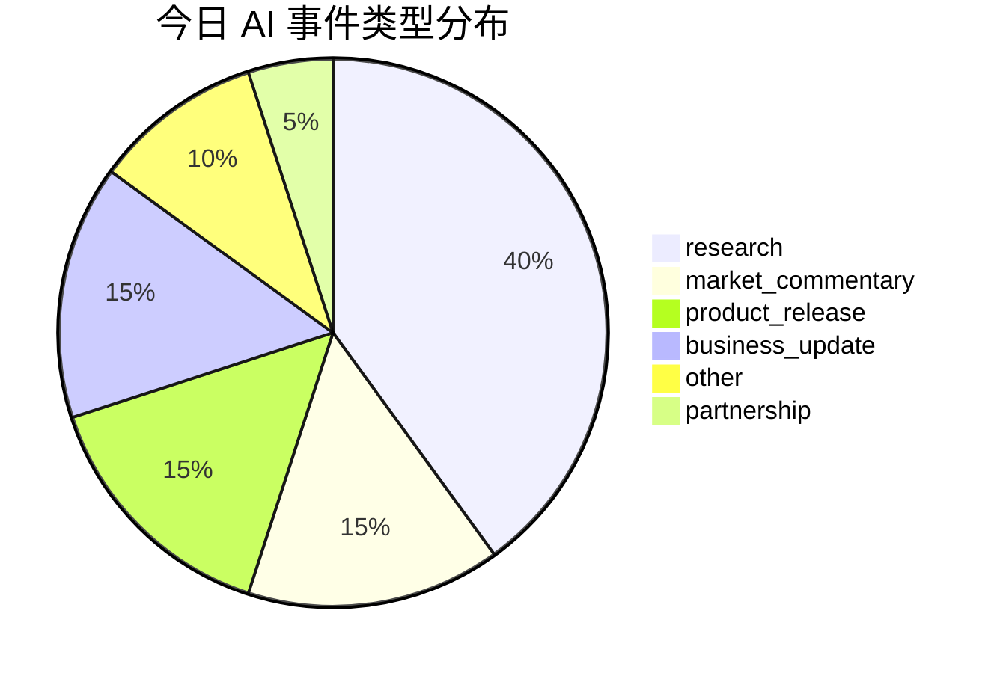
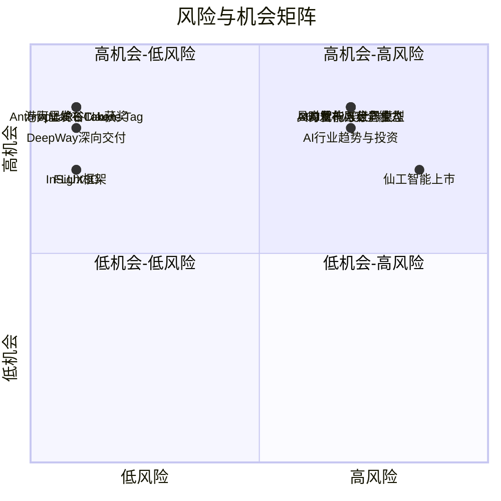

好的，这是为您生成的每日 AI 洞察报告。

***

# 每日 AI 洞察引擎报告

**报告日期**: 2026-06-24
**生成时间**: 2026-06-24T09:56:39Z

---

## 1. 今日概览

今日 AI 领域呈现出 **“产业落地加速”与“前沿理论突破”** 并行的双轨态势。在产业端，物理 AI 在货运物流领域率先跑通商业闭环，Anthropic 和阿里等巨头则分别从团队协作和成本优化角度推动 AI Agent 的规模化应用。在学术端，机器人感知、3D 生成和 Agent 模型训练等领域涌现出多项高质量研究，其中港大团队荣获机器人领域顶级期刊最佳论文奖。同时，AI 安全与治理成为行业焦点，360 发布核心安全能力并联合信创巨头发起协作计划，以应对 AI 带来的新型网络威胁。

---

## 2. 今日 AI 领域 Top 5 热点事件

| 排名 | 事件名称 | 核心要点 | 来源证据 |
| :--- | :--- | :--- | :--- |
| **1** | **InSight框架实现VLA模型自主技能获取** | 提出新框架，使机器人无需人类演示即可自主获取技能，在模拟和真实任务中验证。 | `evt_015` (arXiv) |
| **2** | **FLUX3D实现高保真3D高斯生成** | 提出图像到 3DGS 生成新框架，在保真度上显著超越现有所有方法。 | `evt_017` (arXiv) |
| **3** | **OpenThoughts-Agent开源数据配方训练通用Agent模型** | 开源数据管线，基于 Qwen3-32B 微调，在 7 个 Agent 基准测试中平均准确率达 44.8%。 | `evt_018` (arXiv) |
| **4** | **AI增强辅助沟通（AAC）界面设计与评估研究** | 探讨 AI 在辅助沟通技术中的复杂应用，并提出更鲁棒的评估方法。 | `evt_019` (arXiv) |
| **5** | **Hartley神经算子与傅里叶神经算子对比研究** | 提出实值 Hartley 神经算子，并给出选择谱基的预测性规则，为 PDE 求解提供理论指导。 | `evt_020` (arXiv) |

---

## 3. 重要事件深度总结

### 3.1 物理 AI 商业化落地：DeepWay 深向智能重卡规模化交付

- **事件概述**: DeepWay 深向的智能新能源重卡近期实现规模化交付，鸭嘴兽、马士基、安能、申通等头部货运物流企业已开始为其智能驾驶技术付费。这标志着物理 AI 在公路货运领域率先跑通了“数据 scaling”与“商业 scaling”的螺旋上升闭环。
- **关键事实**:
    - DeepWay 深向智能新能源重卡实现规模化交付。
    - 鸭嘴兽、马士基、安能、申通等企业已为智能驾驶技术买单。
    - 物理 AI 落地的核心逻辑是数据 scaling 和商业 scaling 的螺旋上升。
- **影响分析**: 该事件验证了自动驾驶在特定场景（公路货运）下的商业可行性，为物理 AI 在其他垂直行业的落地提供了范本。它表明，AI 从“数字世界”向“物理世界”的跃迁正在加速，并已产生实际商业价值。
- **不确定性**: 报道来源为单一媒体（量子位），且未提供具体交付数量或财务数据，其规模化程度和盈利能力尚需更多证据支撑。

### 3.2 AI Agent 进入团队协作与成本优化新阶段

- **事件概述**: Anthropic 发布 Claude Tag，定位为 Claude Code 的进化版，强调团队协作能力，公司内部约 65% 的代码已由其参与完成。与此同时，阿里 QoderWork 推出国内首个“峰谷 Token”模式，夜间使用 Qwen3.7-Max 模型低至 2 折，大幅降低 Agent 使用成本。
- **关键事实**:
    - **Claude Tag**: Anthropic 推出，更主动、擅长团队协作，公司约 65% 产品代码由其参与完成。卡帕西称其为 LLM 用户界面的第三次重大变革。
    - **峰谷 Token**: 阿里 QoderWork 推出，夜间 22:00 至次日 08:00 运行 Agent 可自动享受优惠，Qwen3.7-Max 模型低至 2 折。
- **影响分析**: 这两件事共同指向 AI Agent 的下一阶段：**从个人工具向组织基础设施演进**。Claude Tag 解决了 Agent 如何融入团队工作流的问题，而“峰谷 Token”则通过价格杠杆解决了规模化应用的成本瓶颈。这预示着 Agent 的普及将进入快车道。

### 3.3 AI 安全与治理成为行业焦点

- **事件概述**: 在 ISC.AI 2026 大会上，360 发布了两大 AI 安全核心能力：“图龙锋”（漏洞自动化挖掘智能体）和“仪天阵”（网络安全自动化防御系统），并联合飞腾、麒麟等信创巨头发起“磐石之盾”安全协作计划。周鸿祎指出，AI 正在将漏洞从稀缺资源变为规模化资源，彻底改写网络安全游戏规则。
- **关键事实**:
    - 360 发布 AI 安全“倚天屠龙”两大核心能力。
    - 360 联合飞腾、麒麟等发起“磐石之盾”安全协作计划。
    - 周鸿祎认为，AI 使漏洞发现更快、更便宜、更规模化，形成新的战略威慑。
- **影响分析**: 该事件反映了产业界对 AI 安全风险的高度重视。随着 AI 能力（如 Anthropic 的 Mythos 模型）的增强，其被用于网络攻击的潜在威胁也急剧上升。360 的布局和合作计划，旨在构建应对 AI 时代新型安全挑战的防御体系，这将成为未来网络安全产业的核心方向。

### 3.4 前沿研究：机器人感知与 3D 生成取得突破

- **事件概述**: 香港大学 MaRS Lab 张富团队凭借 FAST-LIVO2 获得机器人领域顶级期刊 IEEE TRO 的傅京孙纪念最佳论文奖，第一作者郑纯然于 2025 年入选华为“天才少年”计划。此外，FLUX3D 等研究在 3D 内容生成质量上实现了显著提升。
- **关键事实**:
    - **FAST-LIVO2**: 获 IEEE TRO 傅京孙纪念最佳论文奖，一作郑纯然入选华为“天才少年”。
    - **FLUX3D**: 提出新框架，在图像到 3DGS 生成任务上显著超越所有现有方法。
- **影响分析**: 这些成果巩固了中国在机器人感知和 3D 视觉领域的国际领先地位。FAST-LIVO2 的获奖是对其技术价值的认可，而 FLUX3D 等研究则为元宇宙、数字孪生等应用提供了更强大的内容生成工具。

---

## 4. 趋势判断

1.  **物理 AI 进入商业化验证期**: 以 DeepWay 深向为代表的自动驾驶货运案例表明，物理 AI 已从概念验证进入商业闭环探索阶段。**数据与商业的双螺旋 scaling** 是成功的关键。
2.  **AI Agent 从“单兵作战”转向“团队协作”**: Claude Tag 和阿里“峰谷 Token”的发布，标志着 Agent 的发展重点正从提升个人效率转向融入组织流程、降低规模化成本。**团队协作和成本优化** 是 Agent 下一阶段普及的核心驱动力。
3.  **AI 安全从“被动防御”转向“主动对抗”**: 360 发布漏洞自动化挖掘智能体，反映了 AI 攻防双方都在利用 AI 提升能力。**AI 驱动的自动化攻防** 将成为网络安全的新常态，安全产业格局面临重塑。
4.  **开源生态推动 Agent 模型通用化**: OpenThoughts-Agent 等开源项目通过提供高质量的数据配方和训练管线，正在降低通用 Agent 模型的研发门槛，**开源数据与模型** 将成为 Agent 领域创新的重要基础。

---

## 5. 风险与机会提示

### 风险提示

- **AI 安全风险加剧 (高)**: AI 驱动的自动化漏洞挖掘和攻击武器化（如 Mythos 模型）将打破传统攻防平衡，企业需加大在 AI 安全防御上的投入。相关事件: `evt_005`, `evt_008`。
- **高估值与商业化落地不及预期 (中)**: 仙工智能上市首日的大幅波动（暗盘破发、盘中冲高回落）反映了市场对高估值和窄口径市场份额的担忧。投资者需警惕 AI 概念股估值泡沫。相关事件: `evt_011`。
- **模型安全与地缘政治限制 (中)**: Anthropic 最强模型因安全问题被美国政府限制使用，凸显了 AI 模型在安全合规和地缘政治方面的风险，可能影响技术合作与市场准入。相关事件: `evt_008`。

### 机会提示

- **物理 AI 在垂直行业落地 (高)**: 公路货运的成功验证了物理 AI 的商业价值，制造业、农业、交通、家庭服务等领域存在巨大机会。相关事件: `evt_001`。
- **AI Agent 基础设施与服务 (高)**: 峰谷 Token 模式降低了 Agent 使用成本，Claude Tag 展示了团队协作场景。围绕 Agent 的调度、监控、成本优化、工作流集成等基础设施和服务将迎来爆发。相关事件: `evt_003`, `evt_004`。
- **AI 安全解决方案 (高)**: 面对 AI 驱动的网络攻击，市场对 AI 驱动的自动化防御、漏洞挖掘、安全评估等解决方案的需求将急剧增长。相关事件: `evt_005`。
- **开源 Agent 模型与数据 (中)**: OpenThoughts-Agent 等开源项目为开发者提供了低成本、高性能的 Agent 模型训练方案，相关社区和生态建设存在机会。相关事件: `evt_018`。

---

## 6. 可视化说明

### 6.1 今日事件类型分布

### 6.2 风险与机会矩阵

---

## 7. 数据与方法说明

- **数据来源**: 本报告数据来源于 5 个核心信源，包括 2 个中文科技媒体（量子位、36氪）、2 个英文科技媒体（TechCrunch AI、The Verge）以及 1 个学术预印本平台（arXiv AI Search）。所有信源均被评估为“核心”层级，数据获取状态为“成功”。
- **事件筛选与排名**: 从原始新闻和结构化事件中，通过自动化评分系统，综合考量事件的影响范围、来源权威性、新颖性、多源支持度、技术与商业影响、风险与机会水平以及时效性，最终生成 Top 5 热点事件排名。
- **置信度说明**: 报告中标注了每个事件和关键事实的置信度（高/中/低）。对于仅由单一来源报道、缺乏具体数据支撑或存在明显推测性内容的事件，其置信度被标记为“中”或“低”，并在文中注明了不确定性。
- **局限性**: 本报告基于当日可获取的结构化数据生成，可能无法覆盖所有 AI 领域动态。部分事件的分析深度受限于原始信息的详细程度。