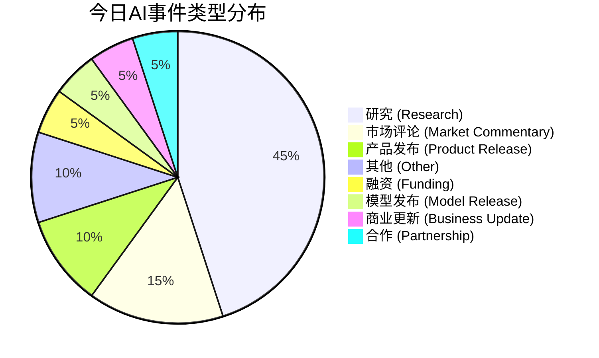

好的，这是为您生成的每日AI洞察报告。

---

# 每日 AI 洞察报告 | 2026年6月24日

## 1. 今日概览

今日AI领域呈现出“应用落地加速”与“基础研究深化”并行的态势。产业端，AI Agent 的商业化探索进入新阶段，阿里推出“峰谷Token”模式以降低使用成本，豆包2.1展示了Agent在芯片设计等复杂工程任务中的潜力。同时，资本对具身智能赛道保持高度热情，正行创新完成近亿美元天使轮融资。在企业级应用方面，浪潮信息高管指出，AI转型的最大门槛并非技术，而是组织与文化的变革。学术界则涌现多项重要进展，包括机器人自主技能获取框架InSight、高保真3D生成模型FLUX3D以及开源智能体数据流水线OpenThoughts-Agent等。

## 2. 今日 AI 领域 Top 5 热点事件

| 排名 | 事件名称 | 核心要点 | 事件类型 | 置信度 |
| :--- | :--- | :--- | :--- | :--- |
| 1 | **小鹏基于亚马逊云科技搭建AI平台** | 小鹏汽车利用亚马逊云科技服务（Kiro, Bedrock, EKS）搭建了内部AI编程与Agentic工作平台“灵犀”。 | 合作 | 中 |
| 2 | **正行创新完成近亿美元天使轮融资** | 具身智能企业“正行创新”完成近亿美元天使轮融资，由正大集团、华勤技术等多家上市企业联合投资。 | 融资 | 高 |
| 3 | **豆包2.1发布** | 豆包发布2.1版本，包含Pro和Turbo两个模型，其Agent可自主完成芯片设计代码，API已上线火山方舟。 | 模型发布 | 高 |
| 4 | **InSight: 自主技能获取框架** | 研究团队提出InSight框架，使机器人视觉-语言-动作模型（VLA）能够在无需人类演示的情况下，自主获取操作技能。 | 研究 | 高 |
| 5 | **AI转型门槛在于人而非技术** | 浪潮信息高管彭震指出，企业AI转型的最大挑战并非基础设施或算力，而是文化、组织和流程的变革。 | 市场评论 | 中 |

*排名依据综合评分，包括影响范围、技术/商业影响、新颖性及来源权威性等。*

## 3. 重要事件深度总结

### 3.1 AI Agent 商业化进入“精耕细作”阶段

今日多个事件表明，AI Agent 正从概念验证走向规模化应用，并开始探索更精细化的商业模式。

- **成本优化成为关键**：阿里QoderWork推出的“峰谷Token”模式（事件ID: `evt_001`），通过夜间时段（22:00-08:00）提供低至2折的优惠，旨在降低用户使用Agent的长期成本。这是国内首个此类产品，预示着Agent服务将借鉴电力、云计算等行业的定价策略，通过错峰使用来平衡资源与成本。
- **能力边界持续拓展**：豆包2.1（事件ID: `evt_004`）展示了其Agent在芯片设计代码生成方面的能力，证明了大型模型Agent在解决高度复杂、专业化的工程问题上的潜力。这标志着AI Agent的应用场景正从简单的对话、信息检索向复杂的生产任务延伸。
- **资本持续加码**：正行创新（事件ID: `evt_003`）近亿美元的天使轮融资，以及行业评论指出“2026年具身智能融资接近去年全年”（事件ID: `evt_014`），均表明资本市场对AI Agent，特别是具身智能方向的未来充满信心。

### 3.2 企业AI转型：技术之外，组织与文化是更大挑战

浪潮信息高管彭震的观点（事件ID: `evt_015`）为当前火热的AI应用浪潮提供了一个冷静的视角。他指出，在推动企业AI转型时，最核心的障碍并非算力、芯片或基础设施，而是企业内部的文化、组织和流程。这一观点与许多行业观察相符，即技术的引入需要配套的管理变革和人才结构调整才能发挥最大效用。这提示我们，在关注技术突破的同时，也需要重视“人”的因素在AI落地过程中的关键作用。

### 3.3 前沿研究：机器人自主性与3D生成取得突破

- **机器人自主技能学习**：来自arXiv的研究InSight（事件ID: `evt_005`）提出了一种新框架，使机器人能够通过“可操控的”视觉-语言-动作模型（VLA）自主学习和获取新技能，而无需人类提供任何目标技能的演示。这为机器人从预设编程走向真正的自主学习开辟了新路径。
- **高保真3D内容生成**：FLUX3D（事件ID: `evt_006`）提出了一种结合扩散对齐稀疏表示的新框架，在从图像生成高质量3D高斯模型方面显著超越了现有最先进方法。这将对游戏、影视、VR/AR等领域的3D内容创作效率产生重要影响。

## 4. 趋势判断

1.  **AI Agent 进入“实用主义”阶段**：行业焦点正从“能否实现”转向“如何高效、低成本地实现”。峰谷Token、Agent自主完成复杂任务等事件表明，业界正在积极探索Agent的商业化路径和实际应用价值。
2.  **“人机协同”成为企业AI转型的核心命题**：技术不再是唯一瓶颈，如何重塑组织流程、培养员工技能、构建适应AI的文化，将成为决定企业AI转型成败的关键。
3.  **具身智能与机器人“大脑”成为资本热点**：资金正大量涌入旨在提升机器人自主决策和感知能力的“大脑”技术，而非仅仅是硬件本体。这预示着未来机器人的核心竞争力在于其智能水平。
4.  **基础研究持续推动AI能力边界**：从机器人自主技能学习到3D生成，再到优化理论，学术界的研究正不断为AI应用提供新的理论支撑和技术可能性。

## 5. 风险与机会提示

### 风险提示
- **企业转型阻力**：浪潮信息高管指出的“文化、组织和流程”问题，是企业在推进AI战略时普遍面临的风险。忽视这一点可能导致巨额投资无法转化为实际效益。
- **行业接受度不确定性**：好莱坞多家制片厂拒绝发行关于OpenAI CEO的传记片（事件ID: `evt_012`），反映出创意产业对AI行业及其领袖仍存在复杂甚至抵触的情绪。这可能预示着AI在内容创作等领域的推广仍面临社会层面的阻力。

### 机会提示
- **AI Agent成本优化**：阿里“峰谷Token”模式为开发者和企业提供了降低Agent使用成本的新思路，可能催生更多依赖夜间算力的AI应用和服务。
- **机器人自主化**：InSight等研究为开发无需大量人工编程和演示的智能机器人提供了可能，这将极大降低机器人部署的门槛，并拓展其在未知环境中的应用。
- **3D内容创作效率革命**：FLUX3D等技术的进步，有望大幅降低高质量3D内容的制作成本和时间，为元宇宙、数字孪生、游戏等行业带来新的增长机会。

## 6. 可视化说明

### 今日事件类型分布

*说明：今日事件以学术研究类为主，其次是市场评论和产品发布，反映出产业应用与基础研究并重的格局。*

### 风险-机会矩阵（Top 5 事件）
```mermaid
quadrantChart
    title 风险-机会矩阵 (Top 5 事件)
    x-axis 低风险 --> 高风险
    y-axis 低机会 --> 高机会
    quadrant-1 高机会-低风险 (机会区)
    quadrant-2 高机会-高风险 (挑战区)
    quadrant-3 低机会-低风险 (观察区)
    quadrant-4 低机会-高风险 (规避区)
    “小鹏-亚马逊云合作”: [0.17, 0.82]
    “正行创新融资”: [0.31, 0.68]
    “豆包2.1发布”: [0.31, 0.84]
    “InSight研究”: [0.34, 0.84]
    “AI转型门槛在人”: [0.50, 0.66]
```
*说明：Top 5事件大多位于“机会区”，表明当前市场情绪积极。其中，“AI转型门槛在人”事件的风险水平相对较高，提示企业在推进AI时应关注内部变革的挑战。*

## 7. 数据与方法说明

- **数据来源**：本报告数据来源于对多个信息源的抓取与分析，包括：
    - **媒体**：量子位、TechCrunch、The Verge等科技媒体。
    - **学术**：arXiv预印本平台。
- **分析方法**：
    - **事件提取**：从新闻和论文中自动提取关键事件，并进行结构化处理。
    - **重要性评分**：基于影响范围、来源权威性、新颖性、技术/商业影响、风险/机会水平及时间新鲜度等多个维度进行综合评分。
    - **排名**：根据综合评分对事件进行排序，形成Top 5热点事件。
- **置信度说明**：报告中每个事件和结论均标注了置信度（高/中/低）。置信度基于证据的充分性、来源的可靠性以及多源交叉验证情况。对于来源单一或证据链不完整的事件，我们已明确标注其不确定性。