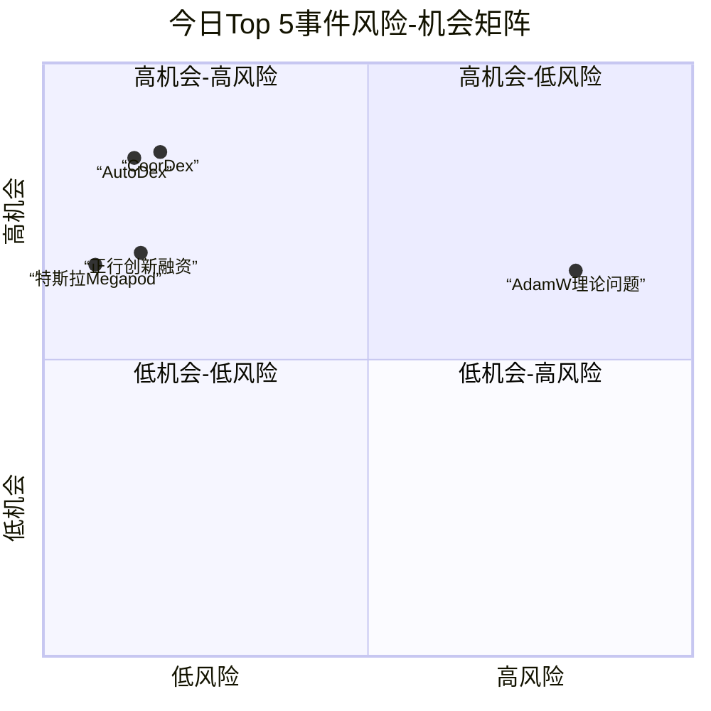

好的，这是为您生成的每日AI洞察报告。

***

# 每日 AI 洞察报告 | 2026-06-24

## 1. 今日概览

今日AI领域呈现出“基础研究突破”与“产业应用落地”并行的活跃态势。在基础研究层面，多项来自顶级学术机构的研究在机器人灵巧操作、大模型长上下文推理等关键领域取得了显著进展。在产业层面，具身智能赛道持续火热，大额融资与重磅产品发布频现，同时，AI在医疗、营销等垂直行业的应用也展现出巨大潜力。值得注意的是，今日排名最高的事件指向了AI基础理论中的一个开放性问题，这提醒我们在追求技术应用的同时，仍需关注底层理论的完善。

## 2. 今日 AI 领域 Top 5 热点事件

| 排名 | 事件名称 | 核心要点 | 关键来源 |
| :--- | :--- | :--- | :--- |
| **1** | **AdamW在重尾噪声下的有效性开放问题** | 提出当前主流LLM训练优化器AdamW在重尾噪声环境下的理论收敛性尚未被证明，这是一个重要的开放性问题。 | arXiv (event_18) |
| **2** | **正行创新完成近亿美元天使轮融资** | 具身智能企业“正行创新”完成近亿美元天使轮融资，由正大集团、华勤技术等多家上市公司联合投资。 | 量子位 (event_3) |
| **3** | **CoorDex: 连续灵巧人形机器人操作** | 提出CoorDex学习管线，首次实现人形机器人在移动中完成灵巧操作（如开门、抓取瓶子），技术突破显著。 | arXiv (event_15) |
| **4** | **特斯拉申请Megapod商标进军AI数据中心硬件** | 特斯拉提交“Megapod”商标申请，计划销售模块化AI数据中心硬件，正式进军AI基础设施领域。 | 量子位 (event_7) |
| **5** | **AutoDex: 自动化灵巧抓取数据收集系统** | 提出AutoDex系统，实现机器人灵巧抓取数据的全自动收集，效率提升4.8倍，且验证后的抓取成功率远高于纯仿真数据。 | arXiv (event_13) |

## 3. 重要事件深度总结

### 事件一：具身智能领域“软硬”齐飞，资本与技术共振

今日具身智能领域成为绝对焦点，资本与技术均展现出强劲活力。

*   **资本层面**：**正行创新（Striding AI）** 完成近亿美元天使轮融资（event_3），投资方包括正大集团、华勤技术、九安医疗等产业巨头。这笔大额融资不仅反映了市场对具身智能商业前景的高度认可，也预示着产业资本正在加速布局该赛道。同时，行业评论指出，2026年尚未过半，具身智能领域的融资总额已超过去年全年，且超过一半的资金流向了机器人的“大脑”技术（event_10），表明行业正从“硬件堆砌”转向“智能核心”的竞争。

*   **技术层面**：两项来自arXiv的研究代表了机器人技术的重大突破。
    *   **CoorDex**（event_15）解决了人形机器人“移动中操作”的难题。该研究让Unitree G1机器人在不停止行走的情况下，完成了抓取瓶子、打开冰箱门等复杂任务。其核心在于将身体与手部的控制解耦为“潜在先验”，再通过协调策略进行组合，为下一代高动态人形机器人提供了关键技术路径。
    *   **AutoDex**（event_13）则解决了机器人学习中的“数据瓶颈”。它构建了一个全自动的数据采集闭环，能以4.8倍于人工遥操作的效率收集真实世界的灵巧抓取数据。更重要的是，基于该系统验证的数据训练的模型，其抓取成功率（76%）远高于仅使用仿真数据训练的模型（34%），证明了真实世界数据对于机器人学习不可替代的价值。

### 事件二：AI基础设施竞争加剧，从芯片到数据中心全面铺开

AI基础设施领域的竞争正在从单一的芯片层面扩展到整个数据中心。

*   **特斯拉的“Megapod”**（event_7）标志着这家电动车巨头正式将AI硬件作为一项独立业务。通过销售模块化AI数据中心硬件，特斯拉意图将其在能源和制造领域的优势延伸至AI算力市场，这可能会对现有的数据中心供应商格局产生冲击。
*   **英伟达的“Halos for Robotics”**（event_6）则从操作系统层面切入，旨在成为机器人领域的“安卓”。这一全栈操作系统的发布，有望降低机器人开发的门槛，加速机器人技术的标准化和普及，对具身智能生态产生深远影响。

### 事件三：大模型能力持续进化，向“推理”与“长上下文”纵深发展

大模型的能力边界正在被不断拓宽，尤其在推理和长文本处理方面。

*   **豆包2.1发布**（event_9）展示了AI Agent在复杂任务上的潜力。其Agent能够自主运行18小时完成芯片设计代码，这标志着AI从“对话助手”向“生产力工具”迈出了重要一步。
*   **Randomized YaRN**（event_14）提出了一种新的训练方法，显著提升了LLM在长上下文（16K-128K tokens）下的推理能力。该研究通过在短文本训练中引入随机位置编码，让模型学会了泛化到更长的文本，这对于需要处理长文档、复杂对话的应用场景至关重要。
*   **GPT-5助力免疫学研究**（event_11）则再次证明了AI在科学发现中的价值。GPT-5 Pro帮助免疫学家解决了一个困扰其3年的T细胞行为谜题，这一突破有望推动癌症和自身免疫疾病的研究。

## 4. 趋势判断

1.  **具身智能进入“大脑”竞赛时代**：资本和技术的双重信号表明，具身智能的竞争焦点已从硬件本体转向了赋予机器人“智能”的算法、模型和操作系统。未来，谁能更好地解决机器人的感知、决策和运动控制问题，谁就能占据行业制高点。
2.  **AI基础设施“模块化”与“标准化”趋势显现**：特斯拉的模块化数据中心硬件和英伟达的机器人操作系统，都指向了AI基础设施的标准化和模块化趋势。这有助于降低AI部署的门槛和成本，但也可能加剧巨头对生态的控制。
3.  **AI for Science进入“问题解决”阶段**：从数学证明到免疫学谜题，AI正从辅助工具转变为能够独立解决科学难题的“合作者”。这一趋势将加速科研范式变革，尤其是在需要海量数据搜索和模式识别的领域。
4.  **企业AI转型的最大挑战是“人”而非“技术”**：浪潮信息高管的观点（event_2）揭示了企业AI转型中的深层障碍。技术可以购买，但组织文化、流程和人员技能的变革才是决定转型成败的关键。这一判断具有普遍性，值得所有正在进行AI转型的企业深思。

## 5. 风险与机会提示

### 风险提示
*   **理论风险**：**AdamW优化器在重尾噪声下的理论空白**（event_18）是一个值得关注的信号。这表明当前驱动LLM训练的底层理论可能并不完备，未来若出现理论上的重大挑战，可能影响现有模型的训练效率和稳定性。该事件风险评分较高（2.458），需保持关注。
*   **转型阻力**：**组织文化变革**（event_2）是企业AI转型中不可忽视的风险。如果企业只关注技术投入而忽视组织层面的配套改革，可能导致AI项目落地困难，投资回报率低下。

### 机会提示
*   **机器人数据服务**：AutoDex（event_13）的成功表明，高质量的真实世界机器人数据是稀缺资源。提供自动化、标准化的机器人数据采集、标注和验证服务，可能成为一个新兴的蓝海市场。
*   **AI驱动的药物研发**：GPT-5在免疫学上的突破（event_11）再次验证了AI在药物发现和疾病机理研究中的巨大潜力。专注于AI+生物医药的初创公司和技术平台将迎来发展机遇。
*   **长上下文应用开发**：Randomized YaRN（event_14）等技术突破，为开发需要处理超长文本的AI应用（如法律文档分析、长篇小说创作、复杂代码库理解）扫清了技术障碍，相关应用市场有望快速增长。

## 6. 可视化说明

### 今日Top 5事件风险与机会矩阵

下图展示了今日排名前五的事件在“风险”与“机会”两个维度上的分布情况。可以看出，大部分事件（如融资、技术突破）呈现出“低风险、高机会”的特征，而排名第一的“AdamW理论问题”则表现出相对较高的风险水平。

### 今日事件类型分布

从事件类型来看，**研究（Research）** 类事件占据了半壁江山，其次是产品发布和商业评论，这反映了今日AI领域“学术驱动”与“产业落地”并重的特点。

## 7. 数据与方法说明

本报告数据来源于对多个信息源的自动化采集与结构化处理，包括：
*   **学术研究**：arXiv AI Search API，获取最新预印本论文。
*   **官方渠道**：OpenAI News RSS、Google DeepMind Blog RSS，获取官方动态。
*   **行业媒体**：量子位（通过DeepSeek Websearch），获取中文产业资讯。
*   **社区讨论**：Hacker News Algolia API，作为辅助信号。

**排名方法**：事件重要性评分（`final_importance_score`）基于一个多维度加权模型，综合考量了事件的影响范围、来源权威性、新颖性、多源支持度、技术与商业影响、风险与机会水平以及时效性。评分越高，代表事件在当日综合重要性越高。

**不确定性说明**：部分事件（如“AI在数学证明中的突破”、“可口可乐AI营销”）的置信度为“medium”，主要因为其信息来源单一（仅来自量子位），且缺乏更广泛的交叉验证。对于这些事件，报告中的判断和趋势分析应视为基于现有信息的初步解读。