好的，这是根据您提供的结构化数据生成的每日AI洞察报告。

---

# 每日 AI 洞察报告 (2026-06-24)

## 1. 今日概览

今日AI领域以学术研究突破为主导，共监测到20个重要事件，主要来自arXiv预印本平台。核心热点集中在**多模态AI**、**AI Agent**以及**AI for Science**三大方向。

- **多模态AI**：在3D生成和视频理解方面取得显著进展。`FLUX3D` 框架实现了高保真的图像到3D场景生成；`EG-VQA` 基准测试强调了视频问答中证据定位的重要性；`OrbitForge` 则展示了利用视频先验知识生成3D场景的新路径。
- **AI Agent**：自主技能获取与代码修复成为焦点。`InSight` 框架使机器人能够无需人类演示自主习得新技能；`OpenThoughts-Agent` 提供了训练Agent模型的开源数据配方；`SHERLOC` 则显著提升了代码修复Agent的定位效率。
- **AI for Science**：大语言模型在科学发现中的应用潜力进一步显现。`GPT-5 Pro` 协助免疫学家解决了一个长达三年的难题；`LLM` 还被用于发现新型量子纠错码，展示了其在复杂科学问题上的推理能力。

今日事件整体风险水平较低，机会水平较高，尤其在机器人技能学习、3D内容生成和科学发现领域。

## 2. 今日 AI 领域 Top 5 热点事件

| 排名 | 事件名称 | 核心领域 | 关键发现 | 来源 |
| :--- | :--- | :--- | :--- | :--- |
| **1** | **EG-VQA: 基于时间证据的可验证视频问答基准** | 多模态AI | 提出了一个包含2067个视频和11838个问答对的新基准，要求模型在回答问题时提供时间证据，并引入`EG-F1`评估指标。 | arXiv (`news_08b5cc561e26`) |
| **2** | **InSight: 通过可操控VLA实现自主技能习得** | AI Agent | 提出`InSight`框架，使视觉-语言-动作模型在基本动作层面变得可操控，从而无需人类演示即可自主习得新操作技能。 | arXiv (`news_de8af1478e75`) |
| **3** | **FLUX3D: 基于扩散对齐稀疏表示的高保真3D高斯生成** | 多模态AI | 提出`FLUX3D`框架，通过改进表示学习和跨模态对齐，在图像到3D高斯泼溅生成任务上达到最先进水平。 | arXiv (`news_42adf9bfa22c`) |
| **4** | **OpenThoughts-Agent: Agent模型的开放数据配方** | AI Agent | 提供了一个完全开源的数据筛选流程，仅用10万条数据微调`Qwen3-32B`模型，即在多个Agent基准测试上超越现有最强开源模型3.9%。 | arXiv (`news_96d08d992c0a`) |
| **5** | **大语言模型通过结构化概念进化发现量子LDPC码** | AI for Science | 引入结构化概念进化（SCE）框架，利用轻量级LLM（`GPT-5.4-mini`）发现了有竞争力的量子低密度奇偶校验码族。 | arXiv (`news_3e87e791c263`) |

## 3. 重要事件深度总结

### 3.1. 多模态AI：从生成到理解的全面进化

今日多模态AI领域成果丰硕，覆盖了从内容生成到内容理解的完整链条。

- **3D内容生成**：`FLUX3D` (evt_003) 和 `OrbitForge` (evt_019) 代表了两种不同的技术路线。`FLUX3D` 通过设计新的扩散对齐结构潜变量（DA-SLAT）和稀疏结构多模态扩散Transformer（SMDiT），直接优化了从图像到3D模型的生成质量。而 `OrbitForge` 则另辟蹊径，利用现成的文生视频模型作为先验，通过3D重建锚定来生成环绕视角的3D高斯泼溅场景，无需特定任务微调。两者共同推动了3D内容创作的民主化和高质量化。
- **视频理解**：`EG-VQA` (evt_020) 基准的发布是一个重要信号。它揭示了当前强大的视频大模型（Video-LLMs）虽然在回答问题上表现不错，但在将答案与视频中的具体时间证据进行关联时存在显著缺陷。为此，他们提出了 `EG-Reasoner` 模型，通过显式的证据监督训练，在开源模型中取得了最优性能，甚至能与闭源模型竞争。这表明，**未来的视频理解研究将更加注重可解释性和证据的忠实性**。

### 3.2. AI Agent：迈向更自主、更高效的智能体

AI Agent领域今日的进展集中在提升自主性和工具使用效率上。

- **自主技能习得**：`InSight` (evt_001) 解决了机器人学习中的一个关键瓶颈——如何在没有人类演示的情况下学习新技能。其核心思想是将VLA模型在“基本动作”层面变得可操控，并利用一个VLM驱动的数据飞轮来自动识别缺失的技能并尝试演示。这为机器人实现真正的持续学习和自主适应环境铺平了道路。
- **开源与效率**：`OpenThoughts-Agent` (evt_004) 证明了高质量、小规模的数据集对于训练强大的Agent模型至关重要，其开源特性将极大促进社区研究。`SHERLOC` (evt_016) 则专注于提升代码修复Agent的效率，通过一个无需训练的框架，将定位准确率提升至84.33%，同时将定位阶段的token消耗减少了36.7%，这对于实际应用中的成本和速度优化意义重大。

### 3.3. AI for Science：大模型成为科学发现的“加速器”

大语言模型正从对话助手转变为科学研究的强大工具。

- **免疫学突破**：`GPT-5 Pro` (evt_017) 帮助免疫学家Derya Unutmaz解决了一个困扰其团队三年的T细胞行为谜题。这一案例生动展示了LLM在整合海量文献、提出新颖假设方面的巨大潜力，有望加速癌症和自身免疫性疾病的研究。**（注：该事件置信度为中等，因证据主要来自OpenAI官方新闻稿，缺乏第三方独立验证。）**
- **量子计算**：`LLM发现量子LDPC码` (evt_018) 是另一个令人振奋的进展。研究团队没有让LLM直接设计代码，而是通过“结构化概念进化”（SCE）框架，让LLM在由代数规范和可执行程序组成的结构化概念空间中进行搜索和变异。这种方法成功发现了超越传统设计的、有竞争力的量子纠错码族，为量子计算的实用化提供了新的可能性。

## 4. 趋势判断

基于今日数据，可以识别出以下关键趋势：

1.  **Agent自主性成为核心追求**：无论是机器人技能习得（`InSight`）还是代码修复（`SHERLOC`），核心目标都是减少对人类干预的依赖，提升Agent的自主决策和行动能力。`OpenThoughts-Agent` 的开源配方将进一步加速这一趋势。
2.  **多模态AI走向“精细化”**：从单纯的“生成”到“可控生成”（`IV-CoT`），从“回答问题”到“提供证据”（`EG-VQA`），多模态AI的研究正在从追求表面效果转向追求结构、逻辑和可解释性。3D生成领域也呈现出多路线并进的态势。
3.  **AI for Science进入“发现”阶段**：AI的应用已超越简单的数据分析和预测，开始参与到科学假设的提出和复杂问题的解决中，如免疫学谜题和量子码设计。这表明AI正从“工具”演变为“合作者”。
4.  **数据质量重于数量**：`OpenThoughts-Agent` 和 `Less is More` (evt_013) 两项研究共同指向一个结论：在特定任务上，精心筛选的高质量小数据集可以媲美甚至超越大规模随机数据集。这为资源有限的研究团队提供了新的思路。

## 5. 风险与机会提示

### 风险提示
- **AI评估的可靠性风险**：`Accuracy and Satisfaction in Multi-Turn LLM Dialogues for NFR Assessment` (evt_011) 研究表明，开发者倾向于信任LLM的评估，但其准确性却很低。这警示我们，在将AI用于关键决策（如合规性评估）时，必须建立独立、严谨的验证机制，避免过度信任。
- **理论基础的脆弱性**：`Difference-Making without Making a Difference` (evt_012) 对因果关系的哲学基础提出了挑战。虽然这属于理论层面，但它提醒我们，AI领域许多基于“因果”或“归因”的方法论可能建立在不够稳固的理论基石上，需要警惕其泛化能力。

### 机会提示
- **机器人技能学习**：`InSight` 框架为机器人领域带来了巨大机遇。相关企业和研究机构可以探索如何将该框架应用于更复杂的工业制造、家庭服务等场景，实现机器人的快速部署和技能更新。
- **3D内容创作**：`FLUX3D` 和 `OrbitForge` 的技术进步将极大降低3D内容创作的门槛。游戏、影视、VR/AR、电商展示等行业应密切关注这些技术，探索将其集成到现有工作流中，以提升内容生产效率。
- **AI驱动的科学发现平台**：`GPT-5` 和 `LLM` 在科学发现上的成功，预示着构建一个“AI科学家”平台的可能性。投资或开发能够辅助科研人员进行文献综述、假设生成和实验设计的AI工具，将具有巨大的市场潜力。
- **高效代码修复工具**：`SHERLOC` 展示了通过精准定位来提升代码修复效率的巨大价值。开发者和DevOps工具提供商可以借鉴其思路，打造更智能、更高效的代码审查和Bug修复助手。

## 6. 可视化说明

### 6.1. 今日Top 5事件综合评分

```mermaid
gantt
    title Top 5 事件综合评分 (满分5)
    dateFormat  X
    axisFormat %s
    section 事件评分
    EG-VQA (3.29) :0, 3.29
    InSight (3.28) :0, 3.28
    FLUX3D (3.28)  :0, 3.28
    OpenThoughts-Agent (3.28) :0, 3.28
    LLM发现量子码 (3.28) :0, 3.28
```



### 6.2. 风险-机会矩阵

下图展示了今日主要事件的风险与机会水平。位于右上角（高机会、低风险）的事件值得重点关注。

```mermaid
quadrantChart
    title 风险-机会矩阵
    x-axis 低风险 --> 高风险
    y-axis 低机会 --> 高机会
    quadrant-1 高机会-低风险 (优先关注)
    quadrant-2 高机会-高风险 (谨慎探索)
    quadrant-3 低机会-低风险 (常规观察)
    quadrant-4 低机会-高风险 (规避)
    EG-VQA: [0.35, 0.84]
    InSight: [0.34, 0.84]
    FLUX3D: [0.31, 0.84]
    OpenThoughts-Agent: [0.31, 0.84]
    LLM发现量子码: [0.30, 0.84]
    OrbitForge: [0.28, 0.84]
    GPT-5免疫学: [0.14, 0.81]
    SHERLOC: [0.28, 0.84]
    混沌系统逆问题: [0.35, 0.69]
    NFR评估: [0.35, 0.07]
```

## 7. 数据与方法说明

- **数据来源**：本报告数据主要来自 **arXiv** 预印本平台（核心来源）和 **OpenAI News** 官方新闻（辅助来源）。今日未从中文媒体（如量子位、机器之心）获取到有效数据。
- **事件识别与排名**：通过自动化流程从结构化新闻中提取事件，并使用多维度评分模型（包括影响范围、来源权威性、技术影响、商业影响、新颖性、风险与机会水平等）进行综合排名。
- **置信度说明**：所有事件均标注了置信度。`GPT-5 Helps Solve Immunology Mystery` (evt_017) 的置信度为“中等”，因其证据主要来自单一官方来源，缺乏第三方独立验证或更广泛的社区讨论。其余事件置信度均为“高”。
- **局限性**：本报告主要基于学术预印本，可能无法完全反映产业界的最新动态。部分事件（如哲学理论探讨）虽然学术价值高，但短期商业影响有限。