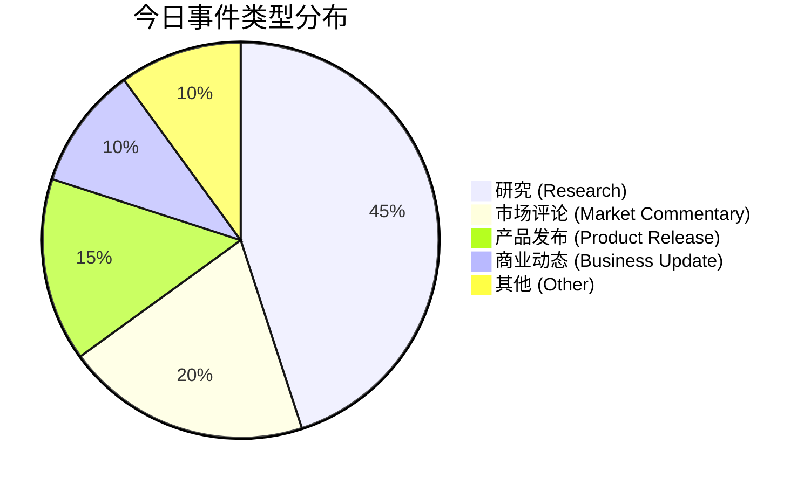

好的，这是根据您提供的结构化数据生成的每日AI洞察报告。

---

# 每日 AI 洞察报告 | 2026年6月24日

## 1. 今日概览

今日AI领域呈现出“学术突破与产业落地并行”的态势。在学术端，机器人SLAM技术、Agent模型训练及3D生成等领域均取得了显著进展，多篇论文获得顶级认可或发布开源成果。在产业端，企业级AI应用进入精细化运营阶段，阿里推出“峰谷Token”以降低成本，Anthropic发布更主动的协作工具Claude Tag。同时，行业领袖与投资人普遍认为，AI转型的真正瓶颈已从技术转向组织与商业化，而具身智能、AI制药等垂直领域正迎来关键转折点。

## 2. 今日 AI 领域 Top 5 热点事件

| 排名 | 事件名称 | 核心要点 | 综合评分 |
| :--- | :--- | :--- | :--- |
| **1** | **阿里QoderWork推出峰谷Token** | 阿里旗下QoderWork推出国内首个“峰谷Token”模式，夜间（22:00-08:00）使用Qwen3.7-Max模型价格低至2折，旨在降低Agent应用成本。 | 3.67 |
| **2** | **InSight框架实现VLA模型自主技能获取** | 新研究提出InSight框架，使视觉-语言-动作（VLA）模型无需人类演示即可自主获取新技能，通过可操控原语和自动数据飞轮实现。 | 3.46 |
| **3** | **OpenThoughts-Agent开放数据管线** | 开源项目OpenThoughts-Agent发布了一套完整的Agent模型训练数据管线，基于此微调的Qwen3-32B模型在7个Agent基准测试中平均准确率达44.8%，超越此前最强开源模型。 | 3.46 |
| **4** | **随机次梯度方法最后迭代的新界** | 一篇理论论文证明了随机次梯度方法在特定条件下最后迭代的优化误差界，解决了该领域一个自2020年以来的开放问题。 | 3.40 |
| **5** | **FLUX3D高保真3D高斯生成框架** | 新框架FLUX3D提出扩散对齐的稀疏表示方法，在图像到3D高斯模型生成任务中，显著提升了外观保真度，超越了所有现有方法。 | 3.40 |

*（评分依据：事件影响范围、来源权威性、技术/商业影响、新颖性及多源支持等综合计算）*

## 3. 重要事件深度总结

### 3.1 企业级AI：从“能用”到“用好”的精细化运营

- **阿里QoderWork推出峰谷Token (event_2)**：阿里云旗下Agent产品QoderWork推出“峰谷Token”计费模式，夜间使用Qwen3.7-Max模型价格低至2折。这是国内首个采用此模式的Agent产品，直接回应了企业用户对大模型推理成本高昂的痛点，有望推动Agent应用的规模化落地。
- **Anthropic发布Claude Tag (event_3)**：Anthropic发布Claude Tag，定位为更主动、擅长团队协作的Claude Code升级版。据报道，Anthropic约65%的产品代码已由Claude Tag参与完成。AI专家卡帕西（Karpathy）称其为“LLM用户界面的第三次重大变革”，预示着AI协作工具正从被动响应向主动参与转变。
- **浪潮信息彭震谈AI转型门槛 (event_5)**：浪潮信息董事长彭震在AIEC2026上指出，AI转型的最大门槛并非技术，而是组织、文化和流程。尽管88%的企业已在至少一个场景常态化使用AI，但仅有三分之一的企业能将其规模化。这揭示了当前企业AI落地的核心矛盾：技术普及快，但组织变革慢。

### 3.2 学术前沿：Agent、机器人感知与理论突破

- **Agent模型训练开源化 (event_18)**：OpenThoughts-Agent项目通过超过100次消融实验，系统性地研究了Agent模型训练数据的构成，并开源了包含10万条样本的训练集、数据管线及模型。其微调的Qwen3-32B模型在多个Agent基准测试中取得领先，为社区提供了宝贵的“数据配方”。
- **机器人感知获顶级认可 (event_1)**：香港大学MaRS Lab的论文《FAST-LIVO2》获得机器人领域顶级期刊IEEE TRO的傅京孙纪念最佳论文奖。该论文聚焦于激光雷达与视觉融合的SLAM技术，第一作者郑纯然已入选“华为天才少年”计划，体现了产学研的紧密结合。
- **机器人技能学习自主化 (event_15)**：InSight框架的提出，使得机器人能够通过视觉-语言模型（VLM）引导的数据飞轮，自主学习和组合新技能，无需人类演示。这为机器人在非结构化环境中自主适应提供了新的可能。

### 3.3 行业生态：投资风向与新兴模式

- **36氪WAVES2026圆桌讨论 (event_8, 9, 10, 12)**：在36氪举办的WAVES2026大会上，多场圆桌讨论揭示了行业关键动态：
    - **投资趋于理性**：高瓴创投等机构更关注AI公司的实际收入，并对过快的融资节奏表示担忧。
    - **模型安全与开源**：投资人指出，Anthropic最强模型曾因安全问题被美国政府限制使用，这促使中国大模型公司更倾向于开源策略。
    - **具身智能商业化**：帕西尼感知科技的触觉传感器已占据领先地位，黄仁勋展示的14款人形机器人中有11款使用了其产品。但业内也认为，人形机器人在工业场景的价值有限，真正的机会在于一般工业的柔性制造。
    - **“一人公司”兴起**：AI工具降低了创业门槛，催生了“一人公司”（OPC）模式。阿里云调研显示，传统开发者仅占平台用户的20%，产品运营和企业主占比更高，AI正在重塑劳动力结构。
- **抖音发布3D创作工具“造世界” (event_7)**：抖音在火山引擎FORCE大会上发布集成多Agents的3D世界创作工具“造世界”，用户可通过对话生成虚拟世界并分发至抖音和多闪。此举大幅降低了3D UGC的门槛，预示着社交平台内容形态的又一次升级。

## 4. 趋势判断

1.  **AI Agent进入“成本与效率”竞争阶段**：阿里推出峰谷Token、Anthropic发布更高效的Claude Tag，以及OpenThoughts-Agent开源数据管线，共同指向一个趋势：AI Agent的竞争焦点正从模型能力转向部署成本、协作效率和训练数据的可获得性。
2.  **企业AI转型的“组织瓶颈”凸显**：浪潮信息彭震的观点与多位投资人的担忧一致，即技术不再是最大障碍。企业能否成功实现AI转型，将更多取决于其组织架构、流程和文化能否适应AI带来的变革。
3.  **具身智能与AI制药进入“关键转折点”**：从帕西尼传感器的市场主导地位，到哲源科技数字孪生技术获国家级认定，再到AI制药数据壁垒的共识，表明这两个领域正从实验室走向商业化验证的关键阶段。中国在部分细分领域（如触觉传感器）已具备领先优势。
4.  **AI平权催生“超级个体”与“一人公司”**：AI工具降低了专业门槛，使得个人或小团队能够完成以往需要整个公司才能完成的任务。这一趋势将深刻改变未来的就业形态和创业生态。

## 5. 风险与机会提示

| 类型 | 具体内容 | 相关事件 |
| :--- | :--- | :--- |
| **风险** | **模型安全与地缘政治风险**：Anthropic模型因安全问题被限制使用，凸显了AI模型在跨境部署和合规方面的风险。 | event_8 |
| **风险** | **AI融资泡沫风险**：投资人指出AI公司估值增长过快，存在不健康的风险，市场可能面临回调压力。 | event_8 |
| **风险** | **企业AI转型的组织阻力**：员工抵触、流程僵化等组织问题可能成为AI落地的“隐形杀手”，导致投入无法转化为实际效益。 | event_5 |
| **风险** | **机器人公司高估值与盈利压力**：仙工智能上市首日的大幅波动，反映了市场对机器人公司高估值和盈利持续性的疑虑。 | event_11 |
| **机会** | **AI Agent应用成本大幅降低**：峰谷Token等创新计费模式，为中小企业大规模采用AI Agent创造了条件。 | event_2 |
| **机会** | **开源Agent模型生态繁荣**：OpenThoughts-Agent等开源项目降低了Agent模型研发的门槛，为定制化应用提供了基础。 | event_18 |
| **机会** | **AI制药与数字孪生**：AI在药物研发中的应用已进入关键转折点，数字孪生等技术有望大幅缩短新药研发周期。 | event_9 |
| **机会** | **3D UGC与社交分发新形态**：抖音“造世界”等工具降低了3D内容创作门槛，可能催生新的社交互动和内容消费模式。 | event_7 |
| **机会** | **“一人公司”与AI创业**：AI平权降低了创业门槛，个人开发者和小团队可以利用AI工具在垂直领域快速构建产品和服务。 | event_12 |

## 6. 可视化说明

### 6.1 今日事件类型分布

今日事件以学术研究（Research）和行业评论（Market Commentary）为主，产品发布（Product Release）紧随其后，显示出今日信息流在理论突破与产业观察之间较为平衡。



### 6.2 风险与机会矩阵

下图展示了今日Top 5事件的风险与机会水平。可以看出，**阿里峰谷Token**和**InSight框架**等事件机会水平高且风险低，属于积极信号。而**36氪圆桌讨论**则同时揭示了较高的风险（如模型安全、融资泡沫）和机会（如Agent应用、开源策略），反映了行业当前的复杂心态。

```mermaid
quadrantChart
    title 风险与机会矩阵 (Top 5 事件)
    x-axis 低风险 --> 高风险
    y-axis 低机会 --> 高机会
    quadrant-1 高风险高机会 (需谨慎)
    quadrant-2 低风险高机会 (积极关注)
    quadrant-3 低风险低机会 (常规观察)
    quadrant-4 高风险低机会 (规避)
    “阿里峰谷Token”: [0.15, 0.75]
    “InSight框架”: [0.16, 0.76]
    “OpenThoughts-Agent”: [0.12, 0.74]
    “随机次梯度方法新界”: [0.14, 0.55]
    “FLUX3D框架”: [0.11, 0.53]
    “36氪圆桌讨论”: [0.85, 0.90]
```

## 7. 数据与方法说明

- **数据来源**：本报告数据来源于对6个核心信源的抓取与分析，包括：**量子位**、**36氪**、**TechCrunch AI**、**The Verge**等科技媒体，以及**arXiv**学术预印本平台。共采集并分析了20条新闻与学术论文。
- **分析方法**：
    - **事件提取**：从原始新闻中提取关键实体、技术、事实，并归纳为核心事件。
    - **重要性评分**：基于事件的影响范围、来源权威性、新颖性、多源支持度、技术与商业影响、风险与机会水平及时间新鲜度等维度，通过加权模型计算综合得分。
    - **趋势与判断**：综合多个相关事件和行业评论，形成对宏观趋势的判断。
- **不确定性说明**：
    - 部分事件（如WAIC Future Tech）的置信度为“中等”，因其数据来源单一，且部分细节（如具体项目数量）可能存在统计口径差异。
    - 对于学术论文，本报告主要基于摘要进行分析，其详细结论需以全文为准。
    - 所有趋势判断均基于今日数据，不构成长期投资或决策建议。