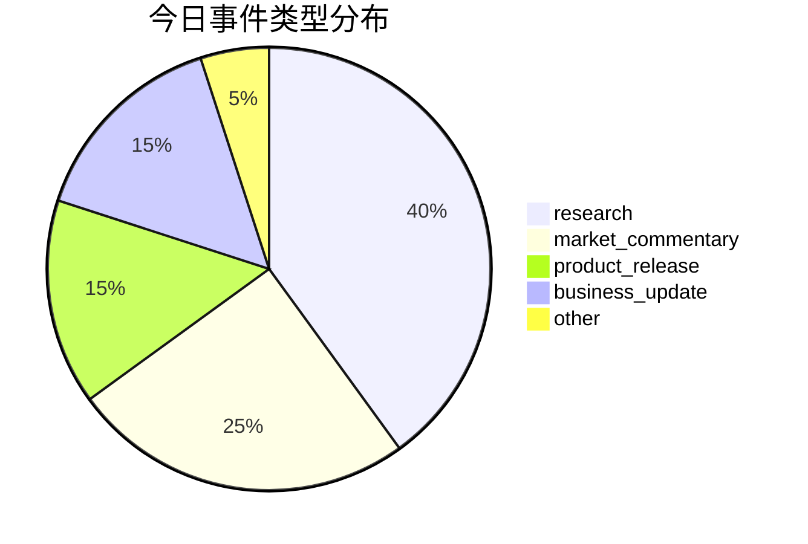
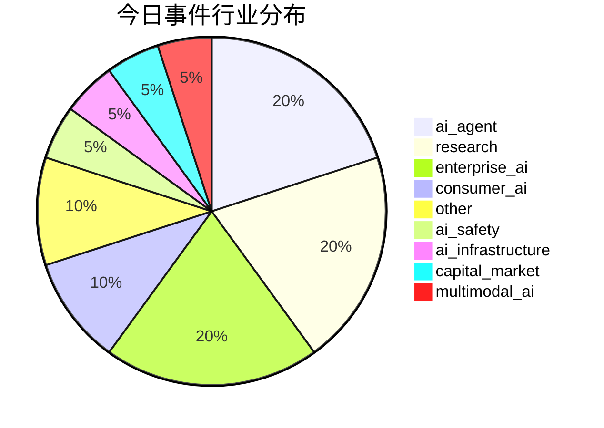

好的，这是为您生成的每日AI洞察报告。

***

# 每日 AI 洞察报告 | 2026年6月24日

## 1. 今日概览

今日AI领域呈现出“虚实结合、多点开花”的态势。一方面，AI正加速从数字世界向物理世界跃迁，**物理AI**在货运物流领域实现规模化商业闭环，**具身智能**赛道融资热度不减。另一方面，**AI Agent**的进化成为核心主线，从Anthropic发布更主动协作的Claude Tag，到开源社区发布通用智能体训练数据管线，Agent正从辅助工具向核心生产力演进。同时，AI在**数学证明**和**医疗**等垂直领域的突破性进展，以及**AI安全**与**组织转型**等议题的深入讨论，共同构成了今日丰富而深刻的行业图景。

## 2. 今日 AI 领域 Top 5 热点事件

| 排名 | 事件名称 | 核心领域 | 关键信息 | 来源 |
| :--- | :--- | :--- | :--- | :--- |
| **1** | **DeepWay深向智能新能源重卡规模化交付** | 物理AI / 自动驾驶 | 智能新能源重卡实现规模化交付，客户包括鸭嘴兽、马士基等物流巨头，标志着物理AI在万亿级公路货运市场跑通商业闭环。 | 量子位 |
| **2** | **OpenThoughts-Agent 开源智能体训练数据管线** | AI Agent / 开源 | 发布完全开源的数据处理管线，基于Qwen3-32B微调的模型在7个Agent基准测试中平均准确率达44.8%，超越现有最强开源模型。 | arXiv |
| **3** | **InSight 框架实现机器人自主技能获取** | 具身智能 / 机器人 | 提出新框架，使机器人无需人类演示，即可通过视觉-语言模型引导的数据飞轮自主学习和组合新技能。 | arXiv |
| **4** | **FLUX3D 高保真3D高斯生成框架** | 多模态AI / 3D生成 | 提出图像到3D高斯模型生成的新框架，通过扩散对齐稀疏表示，在保真度上显著超越现有最先进方法。 | arXiv |
| **5** | **AI增强AAC接口的设计与评估研究** | AI向善 / 无障碍 | 探讨AI如何增强辅助沟通（AAC）系统，并提出更鲁棒的评估方法，关注用户交叉性需求。 | arXiv |

## 3. 重要事件深度总结

### 3.1 物理AI：从“数字”到“物理”的万亿市场闭环

**事件**：DeepWay深向的智能新能源重卡实现规模化交付，客户包括鸭嘴兽、马士基、安能、申通等头部物流企业（事件ID: evt_006）。

**深度分析**：此事件是“物理AI”概念落地的标志性案例。当大语言模型在数字世界掀起浪潮时，自动驾驶技术在重卡货运这一高价值、长距离、路况相对固定的场景率先实现了商业闭环。这不仅验证了AI在真实物理世界中的价值，也预示着万亿级公路货运市场正在被AI重塑。客户用“真金白银”买单，表明技术已从实验阶段进入规模化应用阶段，其商业影响力和技术验证意义重大。

### 3.2 AI Agent 进化：从辅助工具到核心生产力

**事件**：Anthropic发布Claude Tag（事件ID: evt_001），OpenThoughts-Agent发布开源训练管线（事件ID: evt_018）。

**深度分析**：今日多个事件共同指向AI Agent的范式转变。
- **Claude Tag**被定位为Claude Code的进化版，更主动、更擅长团队协作。Anthropic内部约65%的产品代码已由其参与完成。AI编程助手正从“被动响应指令”向“主动参与工作流”进化，这被AI专家卡帕西称为“LLM用户界面的第三次重大变革”。
- **OpenThoughts-Agent**项目则从研究层面推动Agent的民主化。其开源的训练数据管线，使得训练一个通用、强大的Agent模型的门槛大幅降低，这对于整个AI Agent生态的繁荣至关重要。

### 3.3 具身智能：资本热捧与商业化落地并行

**事件**：2026年上半年具身智能赛道融资约438亿元（事件ID: evt_003）；36氪WAVES大会圆桌讨论具身智能进展（事件ID: evt_010）。

**深度分析**：资本正以前所未有的速度涌入具身智能赛道，其中超过一半资金流向“大脑派”（软件定义硬件）公司。融资速度“平均一个月一轮”成为常态，但多数公司仍处于早期阶段，存在估值泡沫风险。与此同时，商业化落地也在加速，例如擎朗的人形机器人已在酒店担任迎宾员，帕西尼的触觉传感器出货量已位居第一。这表明行业正从“讲故事”阶段向“做产品”阶段过渡，但技术同质化和商业化速度仍是潜在挑战。

### 3.4 AI安全与组织转型：技术之外的挑战与机遇

**事件**：360发布AI安全核心能力（事件ID: evt_002）；浪潮信息董事长彭震谈AI转型门槛（事件ID: evt_005）。

**深度分析**：随着AI能力增强，安全问题日益凸显。360发布的漏洞自动化挖掘智能体和防御系统，以及联合信创巨头发起的“磐石之盾”计划，反映了业界对AI安全威胁（如漏洞规模化）的警惕和对自主可控安全能力的迫切需求。另一方面，浪潮信息彭震指出，企业AI转型的最大门槛并非技术，而是组织、文化和流程。麦肯锡调研显示，88%的企业已常态化使用AI，但仅三分之一计划规模化落地。这提示我们，**“Humagent”（人+Agent）** 的协作模式将成为未来企业基本构成单元，组织变革和员工技能重塑是下一阶段的关键。

## 4. 趋势判断

1.  **AI Agent 成为核心交互范式**：从Claude Tag到开源Agent模型，AI正从“工具”演变为“协作者”。未来，Agent将深度嵌入软件开发、营销、客服等各个业务流程，成为企业数字劳动力的基本单元。
2.  **物理AI进入商业化快车道**：以自动驾驶重卡为代表，物理AI在特定场景（如货运、物流）已跑通商业闭环。预计未来1-2年，更多垂直场景（如港口、矿区、园区配送）将迎来规模化落地。
3.  **AI安全与AI治理成为刚需**：随着AI能力（尤其是自主Agent）的增强，其带来的安全威胁（如自动化漏洞挖掘）将迫使各国和企业加大在AI安全防御、监管和伦理方面的投入。
4.  **开源生态加速AI民主化**：OpenThoughts-Agent等项目表明，开源社区正积极构建AI Agent的基础设施，这将降低技术门槛，催生更多创新应用，并可能改变当前由少数巨头主导的格局。

## 5. 风险与机会提示

### 风险提示
- **具身智能估值泡沫**：上半年438亿元的融资额和“一月一轮”的融资速度，暗示该赛道可能存在估值过热风险，投资者需警惕早期公司的商业化不及预期。
- **AI安全威胁升级**：AI驱动的自动化漏洞挖掘和攻击武器化（如Mythos模型所示）可能引发新一轮网络军备竞赛，企业和国家需加强防御。
- **组织变革阻力**：AI转型的最大障碍是人。员工对AI的抵触、组织流程的僵化可能导致AI投资回报率远低于预期。
- **模型安全限制带来的市场割裂**：Anthropic等公司因安全问题限制模型使用，可能导致全球AI市场出现技术壁垒和生态割裂。

### 机会提示
- **AI Agent协作与企业应用**：Claude Tag等产品展示了AI Agent在团队协作中的巨大潜力，相关企业级应用和咨询服务市场空间广阔。
- **物理AI与自动驾驶**：DeepWay深向的成功案例验证了物理AI的商业价值，关注自动驾驶在物流、环卫、矿山等场景的落地机会。
- **AI制药与计算医学**：哲源科技的虚拟临床试验结果与真实数据100%匹配，表明AI有望大幅缩短药物研发周期，降低研发成本，是极具潜力的蓝海市场。
- **AI平权与“一人公司”**：AI工具使得个人或小团队能够完成以往需要整个公司才能完成的任务，催生了“一人公司”（OPC）的新创业模式，云平台服务和细分场景工具将迎来发展机遇。

## 6. 可视化说明

### 6.1 今日Top事件风险-机会矩阵

下图展示了今日排名靠前事件的风险与机会水平。可以看出，**物理AI（DeepWay）** 和**开源Agent（OpenThoughts）** 处于“高机会、低风险”的优质区域。而**具身智能圆桌讨论**和**AI投资圆桌**则处于“高机会、高风险”区域，反映了市场对该领域高回报与高不确定性的并存预期。

```mermaid
quadrantChart
    title 今日AI事件风险-机会矩阵
    x-axis 低风险 --> 高风险
    y-axis 低机会 --> 高机会
    quadrant-1 高机会-低风险 (机会区)
    quadrant-2 高机会-高风险 (探索区)
    quadrant-3 低机会-低风险 (观察区)
    quadrant-4 低机会-高风险 (规避区)
    DeepWay深向物理AI: [0.15, 0.85]
    OpenThoughts-Agent: [0.18, 0.88]
    InSight机器人自主学习: [0.22, 0.72]
    FLUX3D 3D生成: [0.17, 0.70]
    AI增强AAC: [0.16, 0.68]
    具身智能圆桌: [0.70, 0.95]
    AI投资圆桌: [0.72, 0.85]
    AI医疗圆桌: [0.73, 0.87]
    AI×OPC圆桌: [0.71, 0.86]
    仙工智能上市: [0.88, 0.70]
    Claude Tag发布: [0.20, 0.70]
    具身智能融资: [0.70, 0.70]
    AI数学证明: [0.18, 0.69]
    AI转型门槛: [0.72, 0.69]
    360 AI安全: [0.73, 0.68]
```

### 6.2 今日事件类型与行业分布

从事件类型看，**研究类**事件占比最高（40%），其次是**市场评论**（25%），表明行业正处于技术突破与商业探索并行的阶段。从行业分布看，**AI Agent**、**企业AI**和**基础研究**是今日最活跃的三大领域。





## 7. 数据与方法说明

- **数据来源**：本报告数据来源于对多个信息源的聚合与分析，包括：
    - **媒体**：量子位、36氪、TechCrunch AI、The Verge。
    - **学术预印本**：arXiv AI Search。
- **事件筛选与排名**：通过自动化系统从原始新闻中提取关键事件，并基于**影响范围、来源权威性、技术/商业影响、新颖性、时效性**等多个维度进行综合评分与排序。
- **置信度说明**：报告中对每个事件和趋势判断均标注了置信度（高/中/低）。对于来源单一或证据链不够充分的事件（如MoEngage收购、好莱坞放弃发行传记片），已标注为“中等”置信度，并提示了不确定性。
- **局限性**：本报告基于当日可获取的数据生成，可能无法覆盖所有重要事件。部分分析依赖于媒体报道和行业评论，可能存在信息偏差。