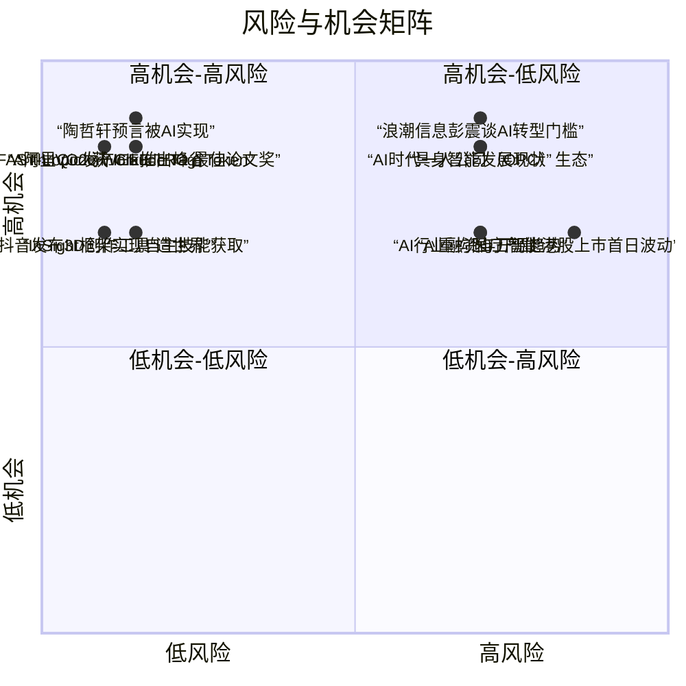

好的，这是为您生成的每日 AI 洞察报告。

***

# 每日 AI 洞察报告 | 2026年6月24日

## 1. 今日概览

今日 AI 领域呈现出“应用深化”与“基础突破”并行的态势。产业端，阿里推出“峰谷 Token”模式降低大模型使用成本，抖音发布 3D 创作工具“造世界”，Anthropic 发布新一代 AI 编程工具 Claude Tag，均指向 AI 工具向更广泛用户群体的渗透。学术端，港大 MaRS Lab 的 FAST-LIVO2 荣获机器人领域顶级期刊最佳论文奖，多项研究在机器人自主技能学习、3D 生成、智能体模型训练等方面取得显著进展。此外，多位行业领袖在 36氪 WAVES2026 大会上指出，AI 转型的最大门槛在于组织与人才，而非技术本身。

## 2. 今日 AI 领域 Top 5 热点事件

| 排名 | 事件名称 | 核心要点 | 来源 | 综合评分 |
| :--- | :--- | :--- | :--- | :--- |
| **1** | **阿里QoderWork推出峰谷Token** | 国内首个上线“峰谷Token”的Agent产品，夜间使用Qwen3.7-Max模型低至2折，旨在降低用户成本。 | 量子位 | 3.95 |
| **2** | **AI增强AAC接口的设计与评估** | 学术论文探讨AI如何增强辅助沟通（AAC）系统，并提出更鲁棒的评估方法，关注AI在辅助技术中的应用。 | arXiv | 3.69 |
| **3** | **浪潮信息彭震谈AI转型门槛** | 浪潮信息董事长指出，企业AI转型的最大障碍是组织、文化与流程，而非技术本身，并提出“Humagent”概念。 | 量子位 | 3.51 |
| **4** | **WAVES2026圆桌：AI时代一人公司（OPC）生态** | 圆桌讨论认为，AI平权使个体拥有公司级生产力，一人公司（OPC）利用AI工具可实现接近公司的交付能力。 | 36氪 | 3.51 |
| **5** | **抖音发布3D创作工具“造世界”** | 集成多Agents的3D世界创作工具，支持多轮对话生成虚拟世界，服务于抖音3D UGC场景。 | 36氪 | 3.47 |

## 3. 重要事件深度总结

### 3.1 产业应用：AI 工具化与成本优化加速

- **阿里QoderWork推出“峰谷Token”**：该事件标志着大模型服务进入精细化运营阶段。通过借鉴电力行业的“峰谷电价”模式，阿里将夜间闲置算力以低至2折的价格提供给用户，这不仅能有效降低开发者和企业的使用门槛，也为AI Agent产品的规模化落地提供了新的成本优化路径。**（来源：量子位，事件ID: event_2）**

- **Anthropic发布Claude Tag**：被誉为“LLM用户界面第三次重大变革”的Claude Tag，其核心在于更主动的协作能力。Anthropic内部约65%的产品代码已由其参与完成，这展示了AI编程工具从辅助编码向深度参与软件工程全流程的演进。**（来源：量子位，事件ID: event_3）**

- **抖音发布3D创作工具“造世界”**：该工具集成了多Agents，允许用户通过自然语言对话生成3D虚拟世界，极大地降低了3D内容创作的门槛。此举是抖音在3D UGC领域的重要布局，有望催生新的内容生态和社交场景。**（来源：36氪，事件ID: event_7）**

### 3.2 学术前沿：机器人感知、技能学习与智能体模型

- **FAST-LIVO2 获 IEEE TRO 最佳论文奖**：由香港大学 MaRS Lab 张富团队研发，第一作者郑纯然（华为天才少年）的 FAST-LIVO2 获得了机器人领域顶级期刊的殊荣。该工作聚焦于激光雷达与视觉的深度融合，代表了SLAM（即时定位与地图构建）领域的前沿水平，彰显了中国学者在该领域的学术影响力。**（来源：量子位，事件ID: event_1）**

- **InSight框架实现自主技能获取**：该研究提出了一种名为InSight的框架，使视觉-语言-动作（VLA）模型能够在无需人类演示的情况下，自主获取并组合新技能以完成长时任务。这为机器人从“预设编程”向“自主学习”的转变提供了关键技术支撑。**（来源：arXiv，事件ID: event_15）**

- **OpenThoughts-Agent：开源智能体模型数据配方**：该项目通过100多次消融实验，系统性地研究了训练通用智能体模型的数据配方。其开源的训练管道和数据集，以及对Qwen3-32B模型的微调结果（在7个基准上平均提升3.9个百分点），为社区训练更强大的智能体模型提供了宝贵资源。**（来源：arXiv，事件ID: event_18）**

### 3.3 行业洞察：转型挑战与生态演变

- **AI转型的最大门槛是人**：浪潮信息董事长彭震的观点在36氪WAVES2026大会上引发共鸣。多位嘉宾指出，技术已不再是瓶颈，如何重塑组织架构、企业文化、员工技能和业务流程，以适应AI驱动的变革，才是企业面临的核心挑战。**（来源：量子位，事件ID: event_5）**

- **AI制药进入关键转折点**：在WAVES2026的圆桌讨论中，嘉宾认为AI制药已从概念验证走向实际应用。哲源科技的前瞻性虚拟临床试验结果与真实数据100%匹配，标志着计算医学在药物研发中的价值得到验证。数据壁垒和跨学科认知被认为是当前的主要挑战。**（来源：36氪，事件ID: event_9）**

- **具身智能：局部领先，整体追赶**：圆桌讨论揭示了具身智能领域的现状。中国在触觉传感器（帕西尼出货量第一）、服务机器人（擎朗海外营收超50%）等细分领域已取得领先，但在具身智能模型层面，与国外仍存在约一代模型的差距。商业化落地速度是当前的主要风险。**（来源：36氪，事件ID: event_10）**

## 4. 趋势判断

1.  **AI 服务“水电化”趋势显现**：阿里“峰谷Token”的推出，预示着大模型算力正从稀缺资源向可灵活定价的公共服务转变。未来，类似“按需计费”、“闲时优惠”的模式将成为AI基础设施的标配，进一步推动AI应用的普及。**（支持证据：事件ID: event_2）**

2.  **AI 编程工具从“辅助”走向“协作”**：Anthropic Claude Tag 的发布及其内部高达65%的代码参与率，表明AI编程工具已不再是简单的代码补全器，而是能够深度参与软件设计、开发与维护的“团队成员”。这将深刻改变软件开发的生产力模型。**（支持证据：事件ID: event_3）**

3.  **AI 转型重心从“技术”转向“组织”**：多位行业领袖的共识表明，企业AI转型的下一阶段，核心瓶颈将从技术能力转向组织变革能力。如何培养“Humagent”（人机协作）文化、重构流程、提升全员AI素养，将成为企业竞争力的关键分水岭。**（支持证据：事件ID: event_5, event_12）**

4.  **开源生态成为智能体模型发展的关键驱动力**：OpenThoughts-Agent 等项目通过开源数据、管道和模型，极大地降低了智能体模型的研究门槛。这种开放协作的模式有望加速通用智能体技术的迭代，并可能改变当前由少数巨头主导的格局。**（支持证据：事件ID: event_18, event_8）**

## 5. 风险与机会提示

### 风险提示

- **融资泡沫风险**：WAVES2026圆桌指出，AI细分领域融资节奏极快，部分公司估值在几个月内翻几倍。这种过热现象可能预示着市场泡沫，投资者需警惕估值与基本面脱节的风险。**（来源：事件ID: event_8）**
- **模型安全与地缘政治风险**：Anthropic最强模型因安全问题被美国政府限制非美国籍公民使用后停服，凸显了AI模型在安全合规和地缘政治背景下的脆弱性。依赖单一或受限制模型的业务面临中断风险。**（来源：事件ID: event_8）**
- **组织变革阻力**：浪潮信息彭震的观点提醒，企业在推进AI转型时，可能面临来自组织文化、员工技能和既有流程的巨大阻力。忽视“人”的因素，可能导致AI项目投入巨大而收效甚微。**（来源：事件ID: event_5）**
- **商业化落地不及预期**：具身智能等前沿领域虽然前景广阔，但商业化落地速度可能慢于市场预期。仙工智能上市首日的股价波动也反映了市场对高估值和盈利持续性的担忧。**（来源：事件ID: event_10, event_11）**

### 机会提示

- **AI成本优化带来的市场增量**：阿里“峰谷Token”模式为中小企业和个人开发者提供了低成本使用顶级大模型的机会。围绕“成本优化”的AI服务和应用，如夜间批处理、自动化任务等，将迎来发展机遇。**（来源：事件ID: event_2）**
- **AI制药与虚拟临床试验**：AI制药已进入关键转折点，虚拟临床试验技术有望大幅缩短新药研发周期、降低成本。该领域存在巨大的技术壁垒和商业价值，是值得长期关注的投资方向。**（来源：事件ID: event_9）**
- **“一人公司”（OPC）生态崛起**：AI平权使得个体创业者能够以极低成本撬动公司级生产力。专注于细分场景、利用AI工具和云服务的“一人公司”将成为新的创业趋势，相关的平台和服务生态也将随之繁荣。**（来源：事件ID: event_12）**
- **开源智能体模型与数据**：OpenThoughts-Agent等项目为开发者提供了训练通用智能体模型的“配方”。基于这些开源资源进行二次开发和应用落地，是技术团队快速切入智能体赛道的有效途径。**（来源：事件ID: event_18）**

## 6. 可视化说明

### 6.1 今日事件类型分布
今日事件以学术研究（Research）和行业评论（Market Commentary）为主，产品发布（Product Release）紧随其后，反映了行业在技术探索与商业化应用上的双重活跃度。

### 6.2 风险与机会矩阵
下图展示了今日主要事件的风险与机会水平。位于右上象限的事件（如“浪潮信息彭震谈AI转型门槛”）兼具高机会与高风险，需要审慎对待；而位于左上象限的事件（如“阿里QoderWork推出峰谷Token”）则呈现出高机会、低风险的特征。

## 7. 数据与方法说明

- **数据来源**：本报告数据基于2026年6月24日采集的20条结构化新闻和20个事件，来源包括**量子位**、**36氪**、**TechCrunch AI**、**The Verge**等科技媒体，以及**arXiv**学术预印本平台。
- **事件排名**：采用多维度评分模型，综合考量事件的**影响范围**、**来源权威性**、**技术/商业影响**、**新颖性**、**时效性**及**多源支持度**，计算得出最终重要性评分并排序。
- **风险与机会评估**：基于事件内容中的关键事实、行业评论及专家观点，对每个事件进行风险与机会水平的量化评估，形成风险-机会矩阵。
- **不确定性说明**：部分事件（如WAIC Future Tech创投生态展示、好莱坞制片厂放弃发行传记片）的置信度为“中等”，主要因其信息来源单一或细节不够充分。所有趋势判断均基于多个事件或结构化字段的交叉验证，当证据链较弱时已在报告中明确标注。